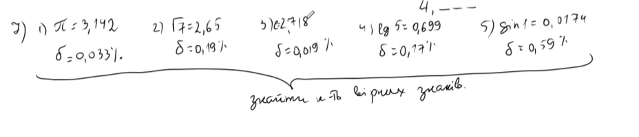

# №1. Знайти суму та похибку
> Input: 0.348, 0.1834, **345.4**, **235.2**, **11.75**, **9.27**, 0.0849, 0.0214, 0.000354

Виділені значення не треба округлювати.
## 1) записуємо все з потрібною точністю (2 знака)
> Rounded: 0.35, 0.18, 345.40, 235.20, 11.75, 9.27, 0.08, 0.02, 0.00

> Sum: 602.25
## 2) Округлюємо результат
> Rounded sum (1 digit): 602.2

## 3) Рахуємо похибку
### Сумарна гранична похибка для наближених вхідних даних
$$\Delta_1 = 10^{-3} + 10^{-4} + 10^{-1} + 10^{-1} + 10^{-2} + 10^{-2} + 10^{-4} + 10^{-6} = 0.221301 < 0.222$$

### Абсолютне значення (знак доданків враховується всередині модуля):
$\Delta = |A - a|$
$$\Delta_2 = |+0.002 - 0.0034 + 0 + 0 + 0 + 0 - 0.0049 - 0.0014 - 0.000354| = 0.008054 < 0.009$$

### Похибка окремого результата
$$\Delta_3 = |602.25 - 602.2| = 0.05$$

### Сумарна похибка обчислень
$$\Delta = \Delta_1 + \Delta_2 + \Delta_3 \le 0.222 + 0.009 + 0.05 = 0.281 < 0.3$$
> Округлили похибку до одного знаку після коми, бо сам результат так округлений

## 4) Результат
$$\sum = 602.2 \pm 0.3$$

# №2. 
$$\rho = 999.8472 \pm 0.001$$

Визначити граничну **відносну** похибку результатів зважування

$$\Delta_p = 0.001 г$$
$$p \le 99.847$$

# №3.
Наближене число $a=24253$. $\delta = 1\%$. **Скільки вірних цифр в числі?**

$$\delta = \frac{\Delta}{|A|}$$
$$\Delta = 24253 \cdot 0.01 \approx 243 = 2.43 \cdot 10^2$$
Варіанти розв'язку:
1. З визначення вірних цифр - $2.43 = \Delta \le \frac{1}{2} \cdot 10^{m-n+1}$;  
    $m = 4$, бо $24253 = 2\cdot 10^4 + ...$.  
    Тоді $n = 4$, бо $2.43 \le 5 = \frac{1}{2} \cdot 10^{1} = \frac{1}{2} \cdot 10^{5-4}$
2. З теореми - $0.01 = \delta \le \frac{1}{\alpha_m \cdot 10^{n-1}}$;  

# №5.

# №6.

# №7.
5 варіантів. Задача - знайти кількість вірних знаків. Двома способами.

