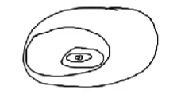
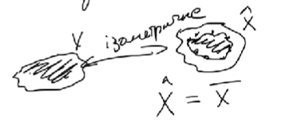
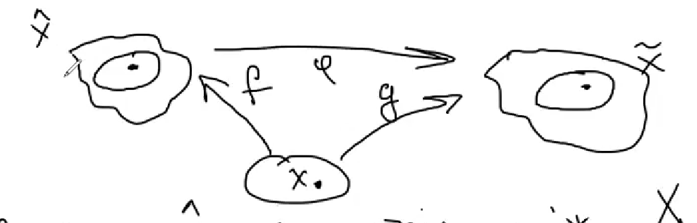
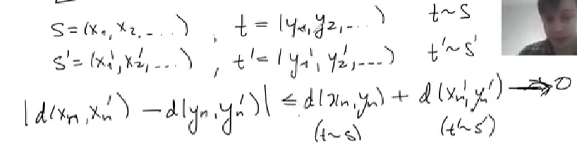

# Функан. Лекція 3. 
**Повнота (продовження)**

**Приклади повних просторів:**

1) $(\mathbb R^n, d_p), d_p(x,y) = \left(\sum_{i=1}^n|x_i-y_i|^p\right)^(1/p)$
2) $C[a,b], d(f,g) = \sup_{a\le t\le b} |f(t) - g(t)|$
3) Дискретний простір ($d(x,y) = \begin{cases}
    1, & x\ne y\\
    0, & x=y
\end{cases}$)  
    > Єдиний випадок збіжної послідовності в цьому просторі - стала послідовність після деякого $n$. Звичайно, така послідовність матиме границю.

**Приклади неповного простору:**
4) $\mathbb R, d_1(x,y) = |e^x-y^y|, d(x,y) = |x-y|$.  
    метрики $d_1, d$ - еквівалентні (тобто, послідовності збігаються та розбігаються відносно обох метрик одночасно / метрики задають однакові топології). Також знаємо, що $(\mathbb R, d)$ - повний.

    Але $(\mathbb R, d_1)$ - не повний. Приклад:

    $\{x_n\}_{n\ge 1}, x_n = -n$.  
    $d_1(x_n,x_{n+1}) = |e^{-n}-e^{-m}| \underset{n,m\to \infty}{\longrightarrow} 0$ 
    $d_1(x_n,x) = |e^{-n}-e^{x}| \underset{n\to \infty}{\longrightarrow} e^x \ne 0 $  
    Тобто 0 не може бути границею, хоча інших границь не може існувати.

В чому ж проблема?  
$e^x$ - бієкція, але між $\mathbb R$ та $(0,\infty)$ - нуль та нескінченність не включається

Як зробити простір повним? Додати ті елементи, до яких прямують незбіжні границі. Штучно додамо 0 та нескінченність.

Насправді, **довільний неповний метричний простір можна розширити до повного**. Також існують найменші розширення.

5) $C[a,b], d_1(f,g) = \int_a^b |f(t)-g(t)|dt$.  
    $(C[a,b], d_1)$ - не повний мет.простір:
    $$f_n(t) = \begin{cases}
        1, & t\ge c\\
        0, t\le c-\frac{1}{n}\\
        \text{linear}, t\in[c-1/n,c] 
    \end{cases}$$
    Нехай $m<n$. Використаємо, що функції відрізняються лише на лінійній частині.
    $$d_1(f_n,f_m) \le \int_{c-1/n}^c 2dt = \frac{2}{n} \underset{n,m\to \infty}{\longrightarrow} 0$$
    $$d_1(f_n,f) \to 0 \implies f(t)=\mathbb{1}(t \ge c) \notin C[a,b]$$

6) $l^2 = \{x=(x_1,x_2,...) \;|\; \sum_{i=1}^\infty x^2_i < \infty\}$.
    $d(x,y) = \sqrt{\sum_{i=1}^\infty (x_i-y_i)^2}$.  
    $(l^2, d)$ - повний метричний простір

    Нехай $(x^{(k)})_{k\ge 1}$ - фундаментальна послідовність (послідовностей) в $l^2$.
    $$d(x^{(k)},x^{(m)}) = \sqrt{\sum_{i=1}^\infty (x_i^{(k)}-x_i^{(m)}} \underset{k,m \to \infty}{\longrightarrow} 0$$
    Будуємо кантидата в границю $x^{(n)}$: шукаємо границю кожного елемента послідовності окремо, а потім збираємо в послідовність. Для деякого елемента послідовностей з номером $n$:
    $$|x_n^{(k)}-x_n^{(m)}| \le \sqrt{\sum_{i=1}^\infty (x_i^{(k)}-x_i^{(m)})^2} \to 0$$
    Тобто $\exists \lim_{k\to\infty} x^{(k)}_n =: x_n$. А границею буде $(x_1, x_2, ...)$.

    $$\varepsilon>0: \exists N: \forall k,m\ge N: d(x^{(k)},x^{(m)}) \le \varepsilon$$
    $$\sum_{i=1}^\infty (x_i^{(k)}-x_i^{(m)})^2 \le \varepsilon^2$$
    $$\sum_{i=1}^M (x_i^{(k)}-x_i^{(m)})^2 \le \varepsilon^2$$
    Прямуємо $m \to \infty$. Можемо так робити, бо $x_i^{(m)} \to x_i$.
    $$\forall M\ge 1: \sum_{i=1}^M (x_i^{(k)}-x_i)^2 \le \varepsilon^2$$
    $$\sum_{i=1}^\infty (x_i^{(k)}-x_i)^2 \le \varepsilon^2$$
    Тоді:
    - $\sum_{i=1}^\infty x_i^2 < \infty$
    - $d(x^{(k)},x)\le \varepsilon$

---

**Твердження**
1) Замкнений підпростір повного простору - також повний
2) Повний підпростір метричного простору - замкнений

*доведення*:
1) Нехай $(X, d)$ - повний, $Y\subset X$ - замкнена.

    нехай $(x_n)$ - фунламентальна в $Y$. Тоді вона фундаментальна в $X$. Тоді вона збігається до $x\in X$. Але через замкненість $x\in Y$. Отже, $(x_n)$ збіжна в $Y$.

2) Нехай $Y \subset X$ - повний підпростір. $y \in \overline Y$. Тоді існує послідовність $(y_n) \subset Y$, що збігається до $y$. Тоді $(y_n)$ - фундаметальна. Тоді $(y_n)$ збігається в $Y$. Тоді $y\in Y$.

Доведено.

---

**Теорема** (про вкладені кулі)  
Нехай $(X,d)$ - метричний простір.  
$(X,d)$ - повний тоді і тільки тоді, коли  
довільна послідовність вкладених замкнених куль, радіуси яких прямують до 0, має непорожній перетин.

*Доведення:*  
1) (Необхідність) Нехай $X$ - повний.
    $B_n = \overline B(x_n,r_n), B_1 \supset B_2 \supset ..., r_n \to 0$  
    $d(x_n, x_m)^{n\le m} \le r_n \longrightarrow_{n\to\infty} 0$  
    $\exists \lim x_n =: x, \quad n \ge N \implies$  
    $x_n \in B_N$. Замкнена куля - замкнена. $x_n \to x \in B_N$.  
    Тобто $\displaystyle \bigcup_{i=1}^\infty B_n \ne \varnothing$  

2) (Достатність) Нехай $(x_n)_{n\ge1}$ - фундаментальна в $X$.  
    $\exists n_1 \forall n,m \ge n_1: d(x_n,x_m)\le 1/2$  
    $\exists n_2 \forall n,m \ge n_2: d(x_n,x_m)\le 1/4$  
    ...  
    $\exists 1 \le n_1 < ... < n_k < ... : \forall n,m \ge n_k: d(x_n,x_m)\le \frac{1}{2^k}$  
    $d(x_{n_k}, x_{n_{k+1}}) \le 2^{-k}$  
    $B_k = \overline B(x_{n_{k}}, 2^{-k+1})$

    Тобто просто показали як вибрати кулі. Залишається показати, що вони вкладені.

    Нехай $y \in B_{k+1}$. $d(y, x_{n_{k+1}}) \le 2^{-k}$.  
    $d(y,x_{n_k}) \le d(y, x_{n_{k+1}}) + d(x_{n_{k+1}}, x_{n_k} \le 2^{-k+1}$.  
    $\exists x \in \bigcap_{k\ge 1} B_k: d(x_{n_k},x)\le 2^{-k+1} \to 0$. $x_{n_k} \to x$.

    Тепер покажемо, що в перетині є якийсь елемент $x$. Відстань до x_n_k менше радіуса n-ї кулі.

    $\varepsilon >0. \exists N: \forall n,m \ge N: d(x_n,x_m) < \varepsilon /2$. Тоді $\exists n_k \ge N: d(x_{n_k}, x) \le \varepsilon /2$.  
    Якщо $n\ge N$ то $d(x_n, x) < \varepsilon$.

    Тут використано, що для фундаментальної послідовності для збіжності достатньо збіжності підпослідовності

Доведено.

---

# Поповнення метричного простору

> Def. Повний метричний простір $(\hat X, \hat d)$ є поповненням метричного простору $(X,d)$ якщо $X$ - ізометричне всюди щільній підмножині $X$.

(простори ізометричні, якщо одне - образ іншого під дією ізометричного відображення)

**Теорема**  
Для довільного мет простору $(X, d)$ його поповнення *існує* та *єдине* з точністю до ізометрії.

*Доведення*  
1. (Єдиність) Нехай $(\hat X, \hat d), (\tilde X, \tilde d)$ - різні поповнення $(X,d)$
    $f: X\to \hat X$ - ізометрія між X та f(X)  
    $g: X \to \tilde X$ - ізометрія між X та g(X).  
    Шукаємо ізометрію між f(X) та g(X).
    
    Нехай $\varphi = g \circ f^{-1}$.
    Нехай $\hat x \in \hat X$. $\hat X$ - всюди щільна в $X$, отже $f(x_n) \to \hat x$. f(x_n) - збіжна => фундаментальна => (g(x_n)) - фундаментальна в $\tilde X$.  
    $\varphi(\hat x) = \lim_{n\to\infty} g(x_n)$

    вправа: довести, що $\varphi$ - ізометрія.

2. (Існування)  Почнемо з $S(X)$ - множина всіх фундаментальних послідовностей над $X$. $s\in S(X) \implies s=(x_1,x_2,...), d(x_n,x_m) \to 0$.  
    Нехай $S \sim S' \iff \lim_{n\to\infty} d(x_n, x_n') = 0$.
    > відстань між елементами двох фунд послідовностей завжди кудись прямує: $|d(x_n, x_n') - d(x_m,x_m')| \le d(x_n, x_n') + d(x_m,x_m') \to 0$.  
    > $\exists \lim_{n\to\infty} d(x_n, x_n')$

    Це дійсно відношення еквівалентності (rst).  
    $\hat X := S(x) / \sim$  
    $\forall s: [s] - $ клас еквівалентності.

    $\hat d([s],[s']) = \lim_{n\to\infty} d(x_n, x_n')$  

    Питання - чи коректне визначення? Чи буде відстань однакова для будь яких представників класів еквівалентності?

    Нехай $s=(x_1,x_2,...), t=(y_1, y_2,...), s'=(x_1', x_2', ...) t'=(t_1', t'_2,...)$. Нехай $t\sim s, t' \sim s'$.  
    

    > Зауваження: $\hat d([s],[s'])=0 \implies s\sim s' \implies [s]=[s']$

    > Зауваження: Ототожнюємо кожну фунд послідовність з тим, куда вона має збігатися

    $f: X \to \hat X$.  
    $x\in X \implies \exists s=(x,x...) \implies f(x) = [s]$.  
    
    *Покажемо, що f - ізометричне.*  
    let $x,y \in X$. $\hat d(f(x), f(y)) = \lim_{n\to\infty} d(x,y) = d(x,y)$ (тут ми просто обрали сталі послідовності в якості представників класів еквівалентності)

    *Покажемо, що f(X) - всюди щільна в $\hat X$*  
    let $s=(x_1, x_2,...), \varepsilon>0$  
    $\forall n,m \ge N: g(x_n, x_m) \le \varepsilon$.  

    *Покажемо повноту $(\hat X, \hat d)$:*  
    Нехай $([s^k])_{k\ge 1}$ - фунд послідовність.  
    $\forall k\ge 1: \exists x_k\in X: \hat d([s^k], f(x_k))\le \frac{1}{k}$  
    $s = (x_1, x_2, ...). \lim_{k\to \infty} f(x_k) = [s]$.  
    Тобто $[s^k] \to [s]$.

Доведено.

---

