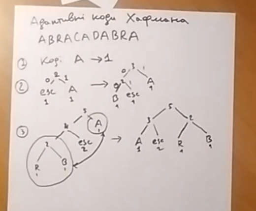

# Лекція 2

```
A -> 0
B -> 10
R -> 110
C -> 1110
D -> 1111
```

> **Умова однозначності декодування**:
> жоден префікс не має збігатись з жодним закінченням

* **Префіксність коду**:
    
    Жодний код не має бути префіксом іншого

> Префіксність - достатня, але не необхідна умова однозначного декодування
> Наприклад, A -> 0, B -> 01. Не префіксний, але однозначний.

Префіксні коди легше декодувати (+-контекстна незалежність)

## Побудова коду Хафмана
### 1. Побудова Дерева Хафмана
1. Виписати всі символи в порядку спадання частот
2. Для двох вершин з найменшими частотами створюємо нову батьківську вершину із частотою рівною сумі їх частот
3. Повторити доки всі символи не потраплять в дерево.
> правий нащадок має частоту не більше, ніж правий
> тобто найменші частоти - зліва знизу

### 2. Маркування дерева
* Всі ліві гілки підписуємо 0, всі праві - 1.

### 3. Коди символів
Кодом буде послідовність бітів на шляху від кореня до символа


## Адаптивні коди Хафмана
Добудовуються по мірі передачі даних

**Основна ідея** - дерево Хафмана будується поступово, в процесі обробки повідомлення, по мірі отримання нових даних. Код, відповідно, змінюється.

> Нотатка. Для великих текстів чи даних добре дослідженої природи не має сенсу використовувати адаптивні коди. Можна просто взяти заздалегідь обчислені середні частоти мови.

Для декодування необхідно відтворити побудову дерева та перебудовувати код по мірі прийому нових даних

**Головна умова дерева Хафмана**
Частота вершини не має бути більша частоти будь-якої більш глибокої вершини 

**Введення нового символа в дерево**
1. Додаємо нову вершину замість літери знизу зліва. Її нащадки - літера, яку замінили та нова літера.
2. Вимагаємо виконання головної умови дерева Хафмана.  
    (Варіант алгоритму) Міняємо місцями пару вершин, які порушують умову
    - обираємо нижнього лівого порушника (у тому числі не листові вершини)
    - обираємо верхнього правого порушника
    


**Як сигналізувати про введення нового символа?**
Необхідно мати окремий символ, що так само міститься в дереві Хафмана.

> Нові символи вводяться в дерево знизу зліва, бо він має найменшу частоту

**Приклад**
```
ABRACADABRA
1. код: A(1)
2.1. новий символ (esc = % = "символ нового символу"). 
    код: %(0), A(1)
2.2. новий символ (B) 
    код: A(1), B(00), %(01)
3. новий символ (R)
    код: A(00) .....

(і так далі)
---
Закодоване повідомлення:
1 0 00 01 
A % B  % 
```

* **Властивість дерева** статичного коду Хафмана:
  Сума всіх нелистових вершин дорівнює довжині закодованого повідомлення

  