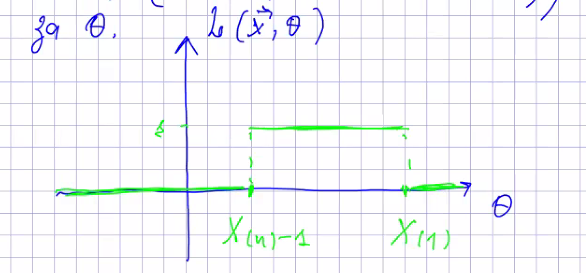

# Матстат. Лекція 3

# Теорія ефективних оцінок

...

### Регулярна модель
...

### Експоненційна модель
...

Обчислимо внесок вибірки для регулярної експоненційної моделі

> todo: повторити теорію щодо внесків

...

> Регулярна експоненційна - ефективна

Обернене тверження

> Якщо ефективна оцінка для $g(\theta)$ існує, то модель є експоненційною  
Справді:
$$u(\vec x, \theta) = \frac{1}{a(\theta}(T(\vec x) - g(\theta))$$
$$\frac{\partial}{\partial\theta} \ln L(\vec x, \theta) = \frac{1}{a(\theta)}(T(\vec x) - g(\theta))$$
Інтегруємо
$$\ln L(\vec x, \theta) = A(\theta) \cdot T(\vec x) + C(\theta) + D(\vec x)$$
$$ L(\vec x, \theta) = e^{A(\theta) \cdot T(\vec x) + C(\theta) + D(\vec x)}$$
That is, модель - **експоненційна**

----

## Методи побудови точкових оцінок.**

## (2) Метод максимальної правдоподібності

> def. **Оцінкою максимальної правдоподібності (ОМП)** параметра $\theta$ наз. така точка $\hat \theta \in \Theta$, в якій фція правдоподібності $L(\vec x, \theta)$ при заданому $\vec x$ досягає макс:
$$\forall \theta\in\Theta: L(\vec x, \hat\theta) \ge L(\vec x; \theta)$$
$$\hat\theta = \arg \sup_{\theta \in \Theta} L(\vec x, \theta)$$

> Заув. Якщо $L(\vec x, \theta_1) > L(\vec x, \theta_2)$, то кажуть, що значення $\theta_1$ **більш правдоподібне** за $\theta_2$.

Якщо максимум $L(\vec x, \theta)$ досягається у внутрішній точці $\Theta$ і $L(\vec x, \theta)$ є диференційовною за $\theta$, то ОМП $\hat \theta$ задовільняє рню:
$$\frac{\partial}{\partial\theta}L(\vec x, \theta) = 0$$
або
$$\frac{\partial}{\partial\theta}\ln L(\vec x, \theta) = 0 \quad (2)$$
Рівняння (2) називається **рівнянням правдободібності**

> можна трактувати як те, що внесок вибірки = 0

**Приклади**
1) $x_1,...,x_n \sim \mathcal N (\theta, \sigma^2)$. ОМП $\hat \theta$ - ?  
    Функція правдоподібності:
    $$L(\vec x, \theta) = \prod_{i=1}^n f(x_i,\theta) = \frac{1}{(\sqrt{2\pi}\sigma)^n}e^{-\sum_{i=1}^n \frac{(x_i-\theta)^2}{2\sigma^2}}$$
    $$\ln L(\vec x, \theta) = C - -\sum_{i=1}^n \frac{(x_i-\theta)^2}{2\sigma^2}$$

    Умова (2): 
    $$\frac{\partial}{\partial\theta}\ln L(\vec x, \theta) = 0$$
    $$\frac{1}{\sigma^2} \sum_{i=1}^n (x_i-\theta) = 0$$
    $$\hat \theta = \frac{1}{n}\sum_{i=1}^n x_i = \overline X - \text{вибіркове середнє}$$

    Оскільки $$\frac{\partial^2}{\partial^2\theta} \ln L(\vec x, \theta) = -\frac{n}{\sigma^2} < 0$$, то $\hat \theta$ - ОМП для $\theta$

    > Заув. $\hat \theta$ - незміщена, змістовна, ефективна

2) $x_1,...,x_n \sim U(0,\theta)$.
    $$L(\overline X, \theta) = \frac{1}{\theta^n} \mathbb{1}(X_{(1)}\ge0, X_{(n)}\le \theta)$$
    $L$ не дифереційовна за $\theta$. Графік:
    

    $\hat\theta = X_{(n)}$ - ОМП для $\theta$.

> Заув. $M(X_{(n)}) = \frac{n}{n+1}\theta$ - зміщена оцінка, але асимптотично незміщена.  
Змістовність:  
$$\forall \varepsilon>0: P(|x_{(n)}-\theta|>\varepsilon) = P(X_{(n)}<\theta - \varepsilon) = P(x_1 < \theta-\varepsilon)^n \longrightarrow 0$$

3) $x_1,...,x_n \sim U(\theta, \theta+1), \theta > 0$.  
    $$L(\vec x, \theta) = \mathbb{1}(X_{(1)}\ge \theta, X_{(n)}\le \theta+1)$$
    Не диференційовна  
    
    Кожна точка у $(x_{(n)}-1;x_{(1)})$ - ОМП.  
    Наприклад, можна взяти $\hat \theta = \frac{1}{2}(x_{(n)} + x_{(1)} - 1)$

## (3) Властивості оцінки максимальної правдоподібності
1) Якщо існує ефективна оцінка $T(\vec x)$ для параметра $\theta$, то ОМП $\hat \theta$ збігається з $T(\vec x)$: $\hat \theta = T(\vec x)$.  
    Дійсно: якщо $T = T(\vec x)$ - ефективна, то за критерієм Рао-Крамера:
    $$T - \theta = a(\theta)\cdot U(\vec x, \theta)$$
    $$u(\vec x, \theta) = \frac{\partial}{\partial\theta} \ln L(\vec x, \theta) = \frac{1}{a(\theta)}(T - \theta)$$
    Отже
    $$\left. \frac{\partial}{\partial\theta}\ln L(\vec x, \theta) \right|_{\theta=\hat\theta} = 0 \iff T = \hat \theta$$

2) Принцип інваріантності ОМП:  
    Якщо $q = q(\theta)$ - бієкція, то ОМП $\hat{q(\theta)} = q(\hat\theta)$, де $\hat \theta$ - ОМП для $\theta$.  

    Справді:  
    

**Приклад**
$$x_i \sim \mathcal N (\theta, \sigma^2)$$
$$g(\theta) = P(X_1 \le x) = \Phi_{0,1}(\frac{x-\theta}{\sigma}$$
ОМП для $g(\theta) - ?$

Шукаємо ОМП для $\theta$:
$$\hat \theta = \overline X$$
В якості $\hat{g(\theta)}$ беремо тоді $\Phi_{0,1}(\frac{x-\overline X}{\sigma})$

---

## 4. Метод моментів

> один з перших. Пов'язано з Пірсоном. Швидкий. Дає наближені, але не дуже корисні точкові оцінки.

> з нього можна починати покращення оцінок

Нехай $x_1,...,x_n$ - вибірка з параметричної моделі $\mathcal F = \{F(x,\theta): \theta \in \Theta\}$. Вибираємо деяку фцію $g: \mathbb R \to \mathbb R$ таку, щоб існував (теоретичний) момент $$Mg(X_1) = h(\theta) \quad (1)$$
і функція $h$ мала обернену в області $\Theta$.

Розв'яжемо рівняння (1) відносно $\theta$:
$$\theta = h^{-1}(Mg(X_1))$$
та покладемо
$$\theta^* = h^{-1}(\overline{g(X)}) = h^{-1}(\frac{1}{n} \sum_{i=1}^n g(X_i))$$

> Def. Оцінка $\theta^*$ наз. **оцінкою методу моментів**

> Заув. Найчастіше в якості $g(y)$ Беруть $g(y) = y^k$. В такому випадку:
$$Mg(X_1) = MX_1^k = h(\theta)$$
$$\theta = h^{-1} ( MX_1^k )$$
$$\theta^* = h^{-1} (\frac{1}{n} \sum_{i=1}^n X_i^k) $$

**Приклад**

Побудуємо ОМП $\theta^*$ за допомогою $g(y) =y$.
$$Mg(X_1) = MX_1 = \theta / 2$$
Тоді
$\theta = 2 \cdot MX_1$ Та  $\theta^* = 2 \cdot \overline X$

Нехай $g(y) = y^k$.  
Тоді
$$Mg(X_1) = Mx^k_1 = \frac{1}{\theta} \int_0^\theta x^k dx = \frac{\theta^k}{k+1};$$
Тоді
$$\theta = \sqrt[k]{(k+1)\cdot MX_1^k}$$
а ОММ:
$$\theta^* = \sqrt[k]{(k+1)\cdot \overline{X^k}}$$

> Заув. Таких оцінок можна побудувати багато, голвоне щоб були моменти.

> Заув. Метод моментів є незастосовним, якщо моменти не існують. Напр. для розподілу Коші.

--- 

**Твердження**:  
Нехай $\theta^* = h^{-1}(\overline{g(X)})$ - ОММ, причому $h^{-1}$ - неперервна. Тоді $\theta^*$ - **змістовна** для $\theta$.

Справді:
$$\overline{g(X)} = \frac{1}{n} \sum_{i=1}^ng(X_i) \overset{P}{\longrightarrow} Mg(X_1)$$
Оскільки $h^{-1} \in C$, 
$$h^{-1}(\overline{g(X)}) \overset{P}{\longrightarrow} h^{-1}(Mg(X_1)) = h^{-1}(h(\theta)) \quad \square$$

---

# Принцип достатності ("Достатні статистики")

**Приклад:**  
$x_1,...,x_n \sim Poiss(\theta)$.  
Спостерігали значення $x_i$, **обчислили** $S = \sum_{i=1}^n X_i$.  
> "Нехай тепер всі записи згоріли, а залишилось лише значення $S$". 
    Все пропало, чи цього достатньо?

Розглянемо умовний розподіл вибірки при заданому значенні статистики $S$:
$$P(X_1=k_1, ..., X_n=k_n \;|\; \sum_{i=1}^n X_i = S) = $$
$$= \frac{P(X_1=k_1, ..., X_n=k_n \;,\; \sum_{i=1}^n X_i = S)}{P(\sum_{i=1}^n X_i = S)} = $$
$$= \mathbb{1}(\sum_{i=1}^n k_i = S) \cdot \frac{P(X_1 = k_1, ..., X_n=k_n)}{P(\sum_{i=1}^n X_i = S)} = $$
> (Застосуємо те, що $\sum_{i=1}^n X_i \sim Poiss(n\cdot \theta)$)

$$= \mathbb{1}(\sum_{i=1}^n k_i = S) \cdot \frac{\frac{\theta^{k_1}}{k_1!}e^{-\theta}\cdot ... \cdot \frac{\theta^{k_n}}{k_n!}e^{-\theta}}{\frac{(\theta n)^S}{S!}e^{-n\theta}} = $$
$$= \mathbb{1}(\sum_{i=1}^n k_i = S) \cdot \frac{S!}{k_1! ... k_n!} \cdot \frac{1}{n^s}$$
**Отримали вираз, що не залежить від $\theta$! (!!!)**

Інтерпретація:
> При відомому значенні $S = \sum_{i=1}^n X_i$ вже неможливо добути ніякої додаткової інформації щодо параметра $\theta$

> Def. Статистика $T=T(\vec x) : \mathbb R^n \to \mathbb R^m \quad (m\le n)$ називається **достатньою** для параметра $\theta$, якщо  
умовний розподіл вибірки при заданому значенні $T = t$  не залежить від ;$\theta$ при будь-якому значенні $t$:
    $$\forall t: \frac{\partial}{\partial\theta} P_\theta \left(\vec X \in \Delta \;|\; T(\vec x) = t\right) = 0$$

**Приклад не достатньої статистики**
$x_1, x_2 \sim Poiss(\theta)$;
$$T = T(X_1, X_2) = 2X_1 + X_2$$
Переконаємося, що $T$ не є достатньою для $\theta$:

$$P\left((X_1,X_2)=(1,1) \;|\; T=3\right) = $$
($x_1=1, x_2=1 \implies T=3$)
$$= \frac{P(X_1=1)P(X_2=1)}{P(X_1=0)P(X_2=3) + P(X_1=1)P(X_2=1)} = $$
$$= \frac{\theta^2 e^{-2\theta}}{e^{-\theta}\cdot \frac{\theta^3}{6}e^{-\theta} + \theta^2 \cdot e^{-2\theta}} = (\text{шось шо залежить від }\theta)$$

Отже, $T$ не є достатньою статистикою

