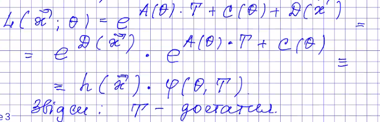
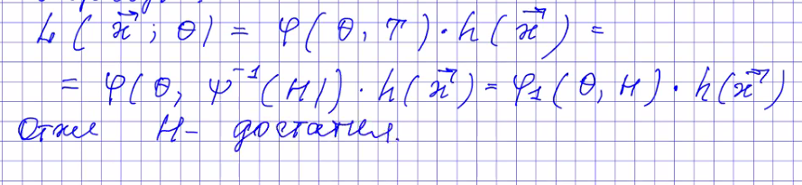
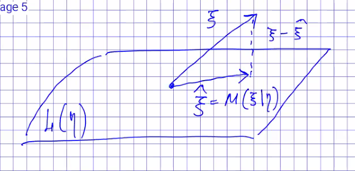
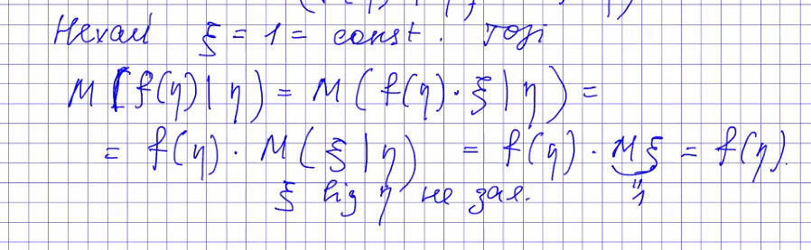
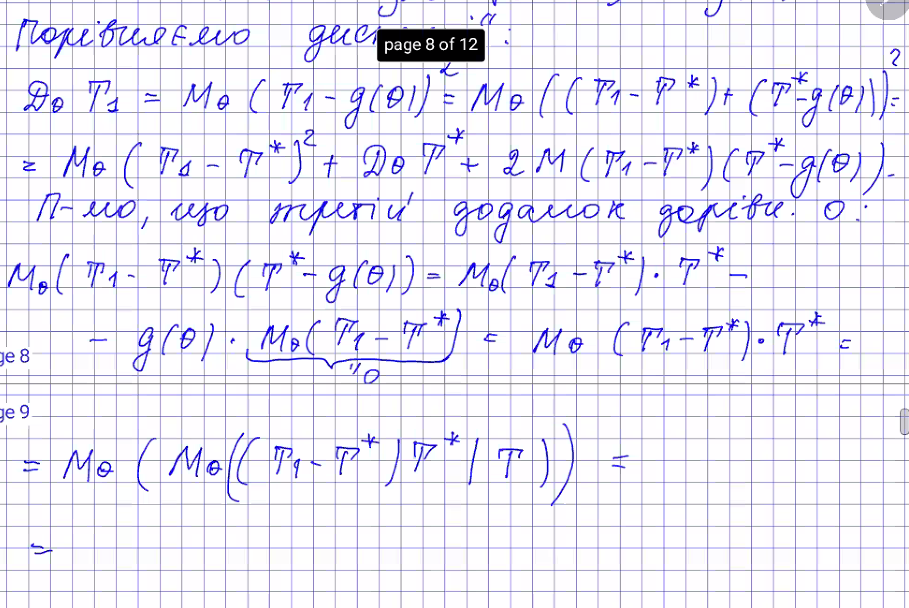
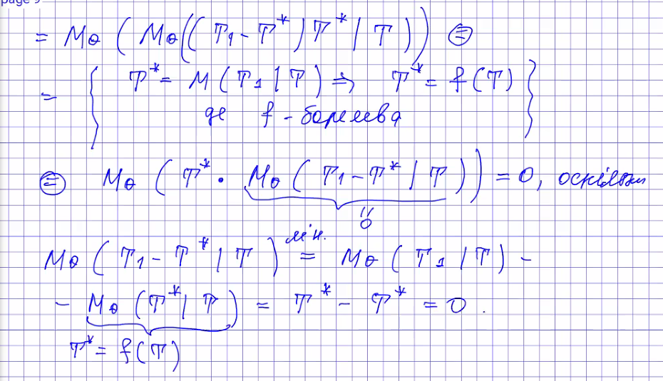
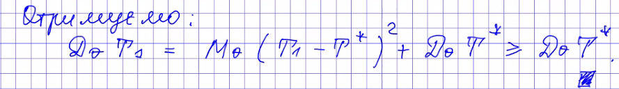
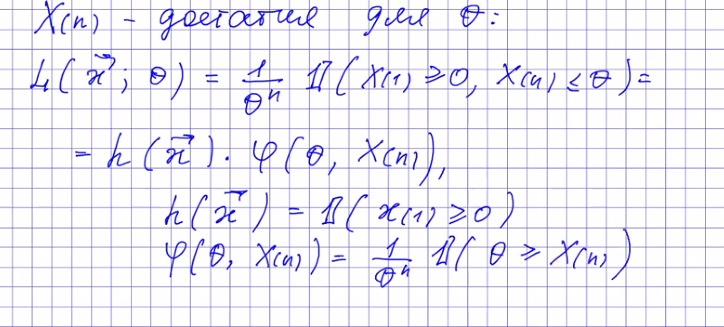

... todo передивитися лекцію та записати що пропустив

## Властивості достатніх статистик 
(Наслідки Теореми про факторизацію)

1) Статистика T - ефективна => T - достатня
    
    > Справді: T - ефективна => модель - експоненційна =>  за теоремою про факторизацію 

2) Статистика Т - достатня, $H = \psi(T), \psi$ - бієкція =>  
    H - достатня

    >  

3) Статистика Т - достатня, а $\hat \theta$ - ОМП для $\theta$.  
    Тоді $\hat \theta = f(T)$.

    > $\hat \theta = \arg \max_{\theta \in \Theta} L(\vec x, \theta) 
    = \arg \max_\theta h(\vec x) \varphi(T,\theta) = \arg \max_\theta \varphi(T,\theta) = f(T)$

# Умовні математичні сподівання
(Вони корисні для покращення оцінок)

### В чому сенс?
Нехай $\xi, \eta$ - в.в. на $(\Omega,\mathcal F, P)$, $M|\xi| < \infty$.  

> Def. Скалярний добуток випадкових величин $\xi, \eta$ - $<\xi,\eta> = M \xi\cdot\eta$

Нехай $L = L(\eta) = \{g(\eta), g - $ борелева функція $\}$. (простір вимірних відносно $\eta$ в.в.)

Умовне матсподівання $\xi$ відносно $\eta$ можна уявити як результат ортогонального проектування $\xi$ на $L$.
 

Результат проектування - деяка така **випадкова величина** (вже не константа) з простору $L(\eta)$, для якої виконується властивість ортопроекції. Тобто $(\xi - \hat\xi)$ ортогональна усім елементам $L(\eta)$:

$\forall g(\eta) \in L: M((\xi-\hat \xi) \cdot g(\eta)) = 0$  
а отже  
$\forall g(\eta) \in L: M(\xi \cdot g(\eta)) = M(\hat\xi \cdot g(\eta))$ (1)

> Def. Нехай $M|\xi| < \infty, $L = L(\eta) = \{g(\eta), g - $ борелева функція $\}$. **Умовним матсподіванням** в.в. $\xi$ відносно в.в. $\eta$ наз. випадкова величина $M(\xi|\eta)=\hat\xi$ така, що:
    1) $\hat\xi \in L$, тобто $\hat \xi = h(\eta)$, $h$ - борелева
    2) $M(\xi\cdot g(\eta)) = M(\hat \xi \cdot g(\eta))$ для довільної борелевої фції $g$

Властивості схожі зі звичайним матсподіванням:  
$M(\xi|\eta) = \arg \min_{g(\eta) \in L} M(\xi-g(\eta))^2$

(звичайне матсподівання - $M\xi = \arg \min_{a\in\mathbb R} (\xi - a)^2$)

### Властивості
1) Лінійність  
    $M(\xi_1 + \xi_2 | \eta) = M(\xi_1|\eta) + M(\xi_2 | \eta)$ *майже напевне* (бо це вже рівність в.в., а не констант)
2) Якщо $f(\eta) \in L$ така що $M(f(\eta) \cdot \xi) < \infty$ то  
    $M(f(\eta) \cdot \xi | \eta) = f(\eta) \cdot M(\xi|\eta)$.

    > Справді:  
        (нехай додатково f - обмежена) Перевіримо, що $\zeta = f(\eta) \cdot M(\xi|\eta) \in L$ та задовільняє умові ортопроекції (1).  
        $\forall g(\eta) \in L: g - $ обмежена $ \implies M(\xi \cdot g(\eta)) = M(f(\eta)\cdot \hat\xi \cdot g(\eta)) = M(\zeta \cdot g(\eta))$  
        Позначимо $h(\eta) = f(\eta)g(\eta)\in L$. Ця фція обмежена, а тому  
     F_\   $M(f(\eta)\xi g(\eta)) = M(\xi h(\eta)) = M(\hat\xi h(\eta)) = M(\zeta \cdot g(\eta))$

3) Якщо $\xi,\eta - незалежні, то $M(\xi|\eta) = M\xi$  
    > $M\xi = const \in L(\eta)$  
        $\forall g(\eta)\in L^b: M(\xi g(\eta)) = M\xi \cdot Mg(\eta) = M(M\xi \cdot g(\eta)). 
        А тоді $M(\xi | \eta) = M\xi$.

4) Якщо $f(\eta) \in L$, $M|f(\eta)|<\infty$ то $M(f(\eta)|\eta) = f(\eta)$.  
    

5) Формула повної ймовірності для умовного матсподівання (Формула повторного матсподівання):  
    $M\xi = M(M(\eta|\xi))$  
    тобто  
    $M\xi = M\hat\xi$, де $\hat \xi = M(\xi|\eta)$

    > нехай $g(\eta) = 1$.  
        Тоді $M\xi = M(1 \cdot \xi) = M(M(\xi|\eta)\cdot 1) = M\hat\xi$

**Приклад**
> $X = \sum_{i=1}^\nu y_i$  
    $\{y_n\}_{n\ge 0} - iid$, $My_i = \mu_i$, $\nu \in \mathbb N$, $\nu$ не залежить від $y_i$.
>
> $MX = M(M(X|\nu)) = M(\nu \cdot My_1) = My_1 \cdot M\nu = \mu \cdot M\nu$

# Покращення оцінок за допомогою достатніх статистик

**Теорема** (про покращення оцінок)
Нехай для $\theta$ існує достатня статистика $T$. Нехай $T_1 |in K_0^g$ - незміщена оцінка для деякої параметричної функції $g(\theta)$.

Тоді оцінка $T^* = M_\theta (T_1 | T)$ - незміщена для $g$ (T^* \in K_0^g) та $D_\theta T^* \le D_\theta T_1$.  
В такому випадку говорять, що $T^*$ є не гіршою за $T_1$

*Доведення*  

---

> Def. Повна статистика:  
    Статистика $T$ наз. повною, якщо  
    $\forall\theta \in \Theta  M_\theta g(T) = 0 \quad \implies g(T) = 0$  
    (g - деяка борелева фція)

(а тепер найголовніше в цій лекції)

**Теорема**  

Нехай $X_1, ..., X_n \in \mathcal F_\theta$. 
$T = T(\vec X)$ - *повна достатня* статистика для $\theta$.  
Тоді якщо оцінка $\hat \theta$ для $g(\theta)$ є функцією від $T$,  
то вона оптимальна.

(зауваження: Рао-Крамер працює лише для регулярних моделей. рівномірний розподіл наприклад не є регулярним. ця теорема працює всюди)

*Доведення*
todo заскріншотити пдфку лекції

Повнота потрібна щоб оптимальна оцінка була єдиною. Якщо б вона по доведенню не була єдиною, ми могли б нескінченно покращувати (не досягли б оптимальності) (можливо, це я так зрозумів).

---

**Приклад**
$X_i \sim U(0,\theta), \quad \theta>0$.  
Ця модель - не регулярна, тому нервіність рао-крамера не працює.

$X_{(n)}$ - достатня для $\theta$:

можна перевірити, що $X_{(n)}$ - повна.

$MX_{(n)} = \frac{n}{n+1} \theta$.  
Тоді $\hat \theta = \frac{n+1}{n}X_{(n)}$ - оптимальна оцінка.

(на наступній лекції розглянемо конструктивні способи обчислення умовного матсподівання. Також розглянемо Байесовий підхід, в якому $\theta$ - також в.в. з якимось апріорним розподілом)

