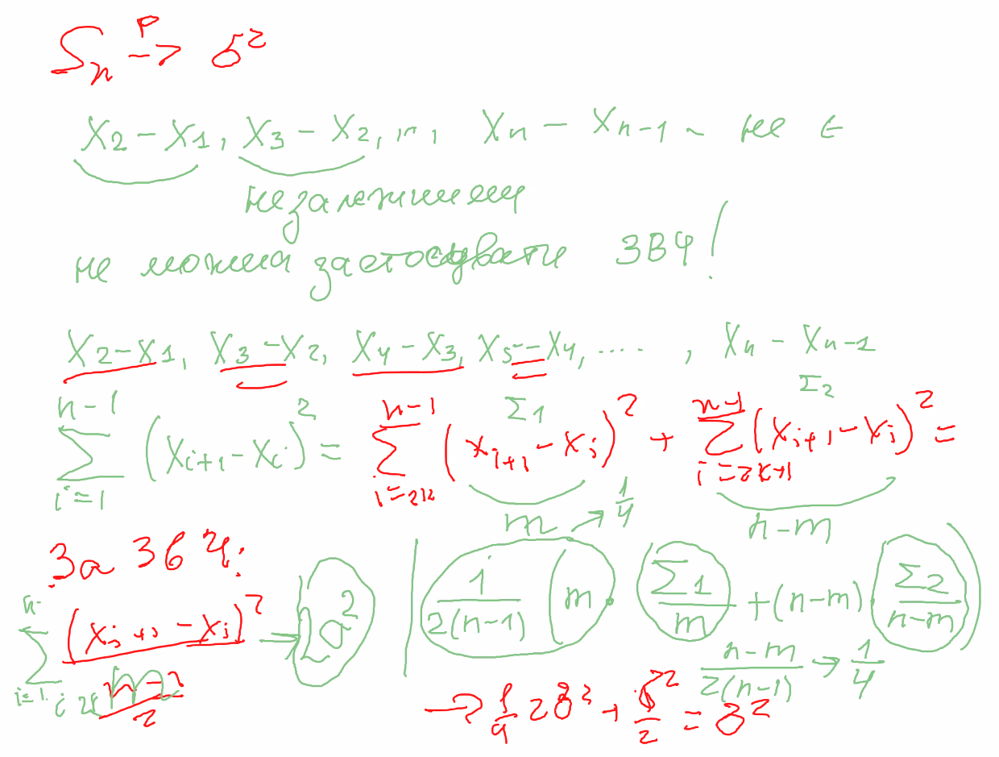
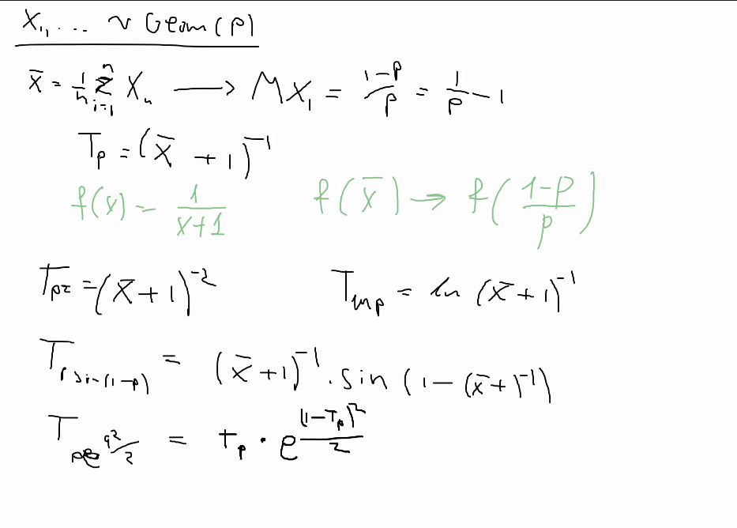
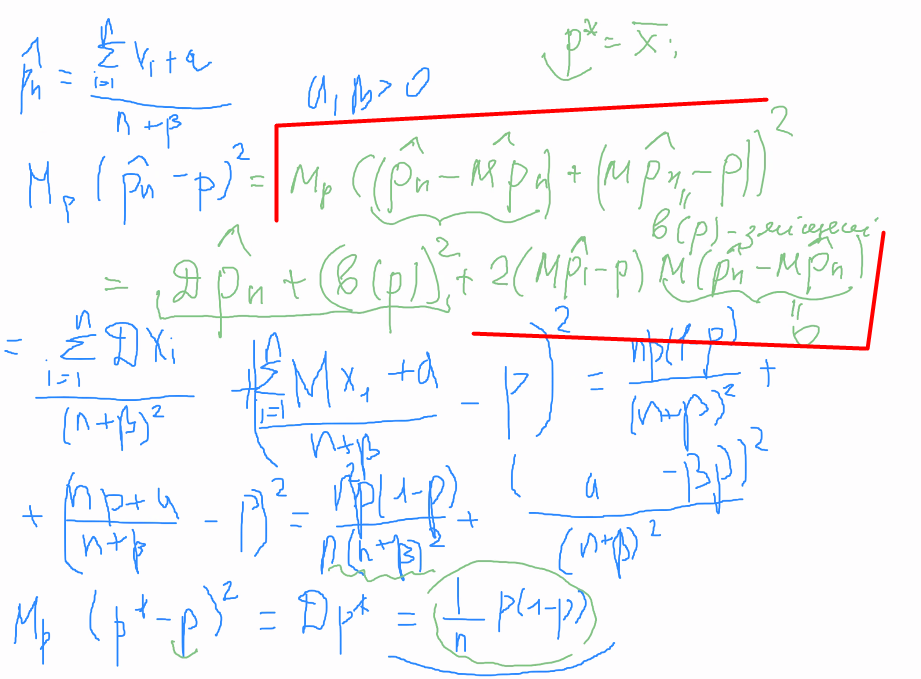

## ЗВЧ

$$\overline X \underset{n\to\infty}{\longrightarrow} MX_1$$

## Змістовність

$$T_n(\vec X) \underset{n\to\infty}{\longrightarrow} $$

> Змістовність оцінки - інваріантна відносно неперервних відображень властивість

## №2.8
$X_1, X_2, ... \sim Exp(\aplha > 1)$  
$\theta_n = e^{\overline X}$

1) 

2) Змістовність  
    $Me^{\overline X} = \left(\varphi_{X_1}(1/ni))^n = \frac{\alpha^n}{(\alpha-1/n)^n} = $  
    $= (1 + \frac{1/n}{\alpha - 1/n})^n = (1 + \frac{1}{\alpha/\sqrt})$

## № 2.9

**Висновок**: якщо знайшли статистику для $p$ - знайшли статистики для всіх неперервних функцій від $p$

## № 2.10
$X_1, X_2, ... \sim B(p)$  
$\hat p_n = \frac{X_1 + ... + X_n + a}{n + b}, \; a,b>0$

$M_p(\hat p_n - p)^2 = M_p((\hat p_n - \hat{M p_n}) + (M \hat p_n - p))^2 = D \hat p_n + (s(p))^2$.  
$s(p) = M \hat p_n - p$ - зміщення оцінки.

$M_p(\hat p_n - p)^2 = \frac{n DX_1}{(n+b)^2} + (\frac{nMX_1 + a}{n+b} - p)^2 = \frac{np(1-p)}{(n+p)^2} + (\frac{np+a}{n+b}-p)^2 = $  
$= \frac{np(1-p)}{(n+p)^2} + \frac{(a-bp)^2}{(n+b)^2}$

$M_p (p'-p)^2 = Dp' = \frac{p(1-p)}{n}$

Порівнюємо оцінки:  
$\frac{p(1-p)}{n} - \frac{n^2p(1-p)}{n(n+b)^2} - \frac{(a-bp)^2}{(n+b)^2} = $  
$= \left(\frac{1}{n}(p(1-p))\right)(1-\frac{n^2}{(n+b)^2}) - \frac{(a-bp)^2}{(n+p)^2} = $  
Підставляємо ($a=\sqrt{n}/2, b = \sqrt n$)  
$= \left(\frac{1}{n}(p(1-p))\right)(1-\frac{n^2}{(n+\sqrt n)^2}) - \frac{(\sqrt{n}/2-\sqrt n p)^2}{(n+p)^2} = $  
$= ...$
