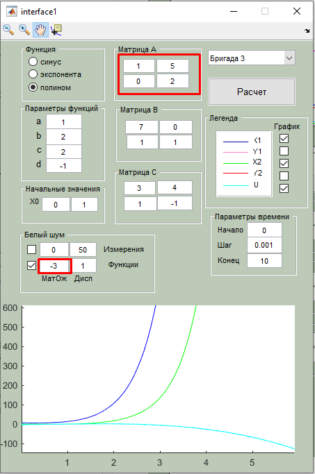

# Теорія керування: лабораторні роботи

**Михайло Корешков, ФІ-91**

## Лабораторна робота 1. Дослідження поведінки математичних моделей об’єктів керування.
**Варіант 3**

**Мета:** Познайомитися з методом простору станів моделювання процесів шляхом досліждення моделі за даними (матрицями числових параметрів) з умови та варіацією окремих числових параметрів.

## Огляд

В цій роботі ми досліджуємо модель простору станів - один з методів опису системи керування.
В цьому методі опису процесів ми маємо справу з декількома об’єктами:
- стан системи $\vec x$
- керуючий вплив (input) $\vec u$
- спостереження (output) $\vec y$

У нашому випадку лінійних моделей, ці змінні пов’язані між собою наступними простими матричними співвідношеннями: 
$$\begin{cases} 
\frac{d\vec x(t)}{dt} &= A\vec x(t) + B \vec u(t) \\ 
\vec y(t) &= C\vec x(t) + D\vec u(t) 
\end{cases}$$

Матриця $A$ відповідає за еволюцію моделі в часі. Матриця $B$ - за реакцію системи на зовнішній керуючий вплив ($\vec u$). А матриці $C$ та $D$ відповідають за те, як саме спостережувані змінні $\vec y$ залежать від стану системи $\vec x$ та керуючого впливу $\vec u$.

У нашій лабораторній нам дано функцію $u(t)$ та значення всіх матриць (матриця $D$ нульова). Також є можливість додати білий (рівномірно розподілений) шум до $u$ та до $y$. 

Матриця $B$, насправді, мала б бути розміру 2x1, бо керуючий вплив у нас одновимірний, а стан - двовимірний. В коді програмного комплексу це реалізовано так, що має сенс лише сума по рядках, а не окремі елементи матриці. 

## Інтерфейс

Задача програмного комплексу - задати всі параметри моделі, чисельно проінтегрувати її, і вивести отриману траекторію руху моделі (графіки).

- Вибір бригади це просто задання початкових даних
- Матриці $A, B, C$ відповідають вищевказаним (з уточненням щодо матриці B)
- Перемикач "функція" вибирає вид $u(t)$
- "Параметри функцій" це універсальні параметри для різних видів $u(t)$. параметри $a,b,c,d$ входять в $u(t)$ по-різному в залежності від її вигляду.
- **3 варіант** має **поліноміальну** функцію виду   
$$u(t) = a + bx + cx^2 + dx^3 + noise_u$$
- інтегрування, звісно, потребує початкових умов $x(t_0) = x_0$. Вони задаються полем "початкове значення"
- параметри інтегрування (t_0, крок, t_1):
  - t_0, t_1 задають бажаний інтервал інтегрування. також з'ясовано, що $x_0 = x(t_0)$, а не $x(0)$
  - "крок" задає крок чисельного інтегрування

Графіки
- Синій X1 та зелений X2 - це компоненти вектору стану $\vec x$
- Рожевий Y1 та червоний Y2 - це компоненти вектору спостережень $\vec y$
- Блакитний U - це керуючий вплив $u$. Важливо розуміти, що $u(t)$ має відому та явну залежність від часу; тобто ця залежність - це вхідні дані, а не результат інтегрування, на відміну від всіх інших змінних на графіку

## Аналіз

Початковий стан інтерфейсу. Одразу для зручності зведу матрицю B до розміру 2x1.

 

1. **Вплив кроку інтегрування**  
  Крок тут впливати буде не сильно, оскільки характеристичний час дуже великий (на відміну від, наприклад, сінуса). 
  Примітивний приклад на іншій фукнції: $u(t) = 10 \sin(30 t)$.  
  Бачимо як змінюється чисельний розв'язок при збільшенні кроку інтегрування від 0.001 до часу, співспавного з періодом сінуса:  
  
  

2. **Вплив межі інтегрування**
  Це важливий параметр, бо поведінка на $(0;1)$ відрізняється від асимптотичної поведінки. Збільшімо часовий інтервал до $(0;10)$:  
    
  Звісно, в результаті бачимо спадання всіх змінних, бо коефіцієнт при $x^3$ в $u(t)$ є від'ємним.

3. **Шум**  
  В моєму розумінні, цей параметр в першу чергу необхідний для дослідження стійкості певних розв'язків системи та стійкості всієї системи в цілому. Шум робить модель більш близькою до реальності та моделює всі невраховані зовнішні впливи, як на керуючий вплив (input), так і на вимірювання (output).    
  **Приклад 1:** великий масштаб з та без шумом  
  
    
  Бачимо, що шум якісно не пливає на поведінку, лише додає локальні кількісні зміни.  
  Це, в припципі, узгоджується з теоретичною стійкостю системи - матриця $A$ має власні значення $-1$ та $-2$ - всі від'ємні. Зауважу, що стійкість тут вживається в сенсі "мала зміна початкових умов відповідтиме малій зміні розв'язку за sup-нормою на довільному часовому інтервалі".  
  **Приклад 2:** нестійка система. Змінимо матрицю $A$ так, щоб вона мала лише додатні власні числа (тут - $1$ та $2$) - більш ніж достатня умова нестійкості. Бачимо, що мала зміна шуму для функції (від -3 до -4) призвела до якісної (та незрівняно великої) зміни розв'язку системи.  
  
  

4. **Початкові значення**  
Для аналізу моделі в моєму розумінні зміна початкового значення потрібна для
    - а) Власне чисельних обчислень розв'язку за певними заданими вхідними параметрами
    - б) Дослідження поведінки системи біля критичних точок (точки чи криві в просторі станів, в околі яких можуть проходити якісно різні розв'язки; також в цих точках матимемо нулі або невизначеності в похідних $x'(t)$; для лінійних систем зазвичай досліджується вільний рух системи в околі нуля)  
    
    Приклади тут не наводитиму, оскільки вони будуть занадто схожі на попередній пункт.

## Теоретичні відомості та відповіді на питання

> В якому вигляді представлено керування у Вашому варіанті?

todo

> Який тип руху розглядається за допомогою даного інтерфейсу? Чому Ви дійшли до такого висновку та які ще типи руху існують.

Тут ми маємо справу з вимушеним рухом системи. Вільний рух системи - це рух без зовнішніх впливів. Під час вільного руху процес розвивається в часі лише завдяки внутрішнім параметрам (тут - матриця $A$). Математично вільний рух є еквівалентним $u(t) \equiv 0$.

> Що таке метод простору станів? В чому його переваги?

Один з методів математичного опису моделей систем, що еволюціонують в (зазвичай неперервному, але існують дискретні варіанти) часі. З особливостей (не обов'язково переваг) можна назвати:
- будь-яке лінійне диф рівняння вищого порядку може бути представлене як лінійна система диф рівнянь 1 порядку в стандартному вигляді, тобто у вигляді методу станів
- можливість використовувати існуючі комп'ютерні пакети роботи з лінійною алгеброю. в тому числі для перевірки моделі на стійкість.
- очевидна кількість входів/виходів для системи (розмірності $\vec u$ та $\vec y$)
- модель містить більше інформації, ніж передатна функція чи диф рівняння вищого порядку (декільком моделям, записаним методом простору станів, може відповідати одна передатна фукнція чи одне дифрівняння)

Переваги:
- Набагато зручніше працювати зі складними системами, особливо якщо розглядаються системи з декількома входами та виходами
- Компактна нотація
- Іноді можливо зменшити розмірність задачі еквівалентними перетвореннями. Це можливо завдяки "надлишковій" інформації в матрицях методу простору станів 
- Оскільки метод використовує лінійну алгебру, можна використовувати багато відомих технік та знань звідти
- Лінійна алгебра також полегшує розробку загальних алгоритмів вирішення задач
- З вищенаведених причин, легко імплементувати алгоримти для обчислювання на комп'ютері
