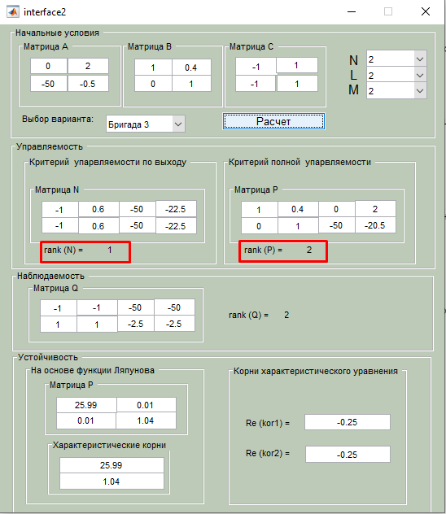
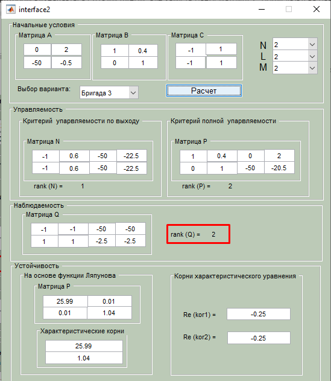
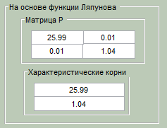

# Теорія керування: лабораторні роботи

**Михайло Корешков, ФІ-91**

## Лабораторна робота 2.  Дослідження властивостей керованості, спостережуваності і стійкості об’єктів керування
**Варіант 3**

**Мета:** Познайомитися з поняттями стійкості, керованості та спостережуваності моделей. Подивитися, як пов'язані між собою прямі та непрямі способи дослідження моделей.

Ми продовжуємо використовувати метод простору станів та маємо матриці A, B, C з умови.

1. Керованість  
    - Система **керована**, якщо для будь-якого початкового стану $x_0$ та будь-якого кінцевого стану $x_1$ можна знайти таку функцію керування $u(t)$, що під впливом неї система перейде з $x_0$ до $x_1$ за скінченний час.  
    - Неформально, система керована, якщо всі стани системи чутливі до керуючого впливу
    - Система **керована за виходом**, якщо та сама властивість виконується не для $x$, а для $y$.  
    - З керованості не випливає керованість за виходом і навпаки
    - Існує відносно простий спосіб перевірки на керованість з допомогою матриці керованості $P$ - ранг цієї матриці має бути рівним n, тобто розмірності змінної стану $\vec x$.  
    $$P = \left\{ B, AB, A^2B, ..., A^{n-1}B\right\}$$
    - В моєму варіанті **система є керованою (за станом)**, бо ранг матриці $P$ = 2, тобто є повним.
    - *Керованість за виходом* визначається схожим чином, але замість рангу матриці $P$ обчислюєтсья ранг матриці $N$ - він має бути рівним розмірності вектора виходу $\vec y = C\vec x$  
    $$N = \left\{CB, CAB, CA^2B, ..., CA^{n-1}B\right\}$$
    - В моєму варіанті  **система не є керованою за виходом**, бо матриця $N$ має неповний ранг 1. Це має сенс - з вигляду $C$ видно, що $y_1(t) = y_2(t)$, тобто безліч вихідних станів, в яких координати не рівні, є в принципі недосяжними
    - 

2. Спостережуваність
    - Система **спостережувана**, якщо для будь-якого скінченного інтервалу часу $(t_0, t_1)$ за відомим спостереженням $\vec y(t)$ та відомим керуванням $\vec u(t)$ можна визначити еволюцію стану системи $\vec x(t)$. Тобто, спостережуваність каже про існування деякої бієкції між станами та спостереженнями за відомого керуючого впливу.
    - Менш формально, система спостережувана, якщо всі її стани впливають на вихідний вектор
    - Спостережуваність також визначається схожим чином: система спостережувана якщо ранг матриці $Q$ є повним.  
        $$Q = \left\{ C^T, A^TC^T, ..., \left(A^T\right)^{n-1}C^T\right\}$$  
        або  
        $$Q = \begin{bmatrix} C \\ CA \\ \vdots \\ CA^{n-1} \end{bmatrix}$$
    - В моєму варіанті **система є спостережуваною**, бо ранг = 2.
    - 

3. Стійкість
    - Розв'язок стійкий якщо малим збуренням його початкового стану відповідають малі збурення всього розв'язку
    - Система стійка, якщо всі її розв'язки стійкі
    - Ми маємо на увазі стійкість вільного руху системи. З цього, звісно, випливатиме стійкість розв'язків і для вимушеного руху.
    - Для нашого випадку лінійної стаціонарної системи: система **стійка**, якщо $$\forall \varepsilon>0: \exists \delta>0: \forall t>t_0:  |x(t_0)|<\delta \implies |x(t)| < \varepsilon$$. 
    - Менш формально, стійкість означає, що ніякі розв'язки не будуть улітати на нескінченність.
    - **асимптотична стійкість** - це просто стійкість з додатковою вимогою прямувати до нуля з часом

4. Метод Ляпунова  
    - Це винятково хитрий метод доведення стійкості системи. 
    - Він базується на пошуку скалярної функції (Ляпунова) стану системи, для якої прямування до нуля буде еквівалентне прямуванню до нуля і самого стану. Достатньою умовою цієї властивості для функції Ляпунова виявляється бути строго зростаючою, бути нульовою в нулі та бути невід'ємною в інших точках. Пошук функції Ляпунова зручно починати з квадратичних форм.  
    - Для стійких лінійних систем існує формула обчислення коефіцієнтів квадратичної форми у функції Ляпунова. Якщо ж система нестійка, то отримана квадратична форма не буде додатньо визначеною.   
    - Програмний комплекс пропонує функцію Ляпунова у вигляді нищевказаної квадратичної форми.   
    Ця форма має лише додатні власні числа, а отже строго зростає в околі нуля; є додатньо визначеною. Тобто, **система є асимптотично стійкою**

5. Метод Власних чисел або Коренів характеристичного рівняння
    - Лінійним системам для стійкості достатньо мати недодатні власні числа матриці $A$. Це випливає з теорії систем лінійних диф рівнянь. В результаті розв'язок системи розпадається на суму комплексних експонент із коренями характеристичного рівняння у якості коефіцієнтів при часовій змінній. 
    - З цього випливає, що розв'язки залишатимуться обмеженими лише якщо не буде коренів із додатньої дійсною частиною. Тобто, ніякі доданки загального розв'язку не будуть збільшувати свій модуль з часом.
    - У моєму варіанті всі корені мають від'ємні дійсні частини, а, отже, ми знову довели, що **система є асимптотично стійкою**    
 
> Що таке прямі та непрямі дослідження при аналізі систем автоматичного керування? Який вид досліджень Ви проводите за допомогою інтерфейсу в даній лабораторній?

Прямі дослідження - це такі, що вимагають пошуку аналітичних (чи чисельних) розв'язків.  
Непрямі дослідження не вимагають розв'язків системи та дають можливість зробити деякі висновки про систему лише з її визначення.

Непрямі дослідження часто більш універсальні, тобто їх результати легше поширювати на класи задач. Також непрямі дослідження легше автоматизувати та адаптувати для обчислення на комп'ютерах - особливо для лінійних задач.
