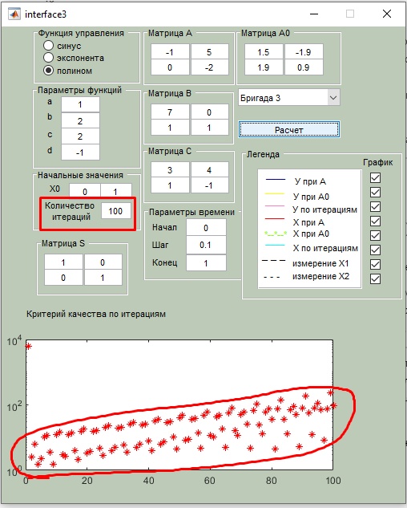
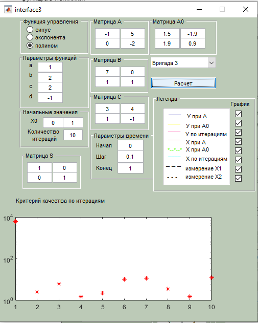
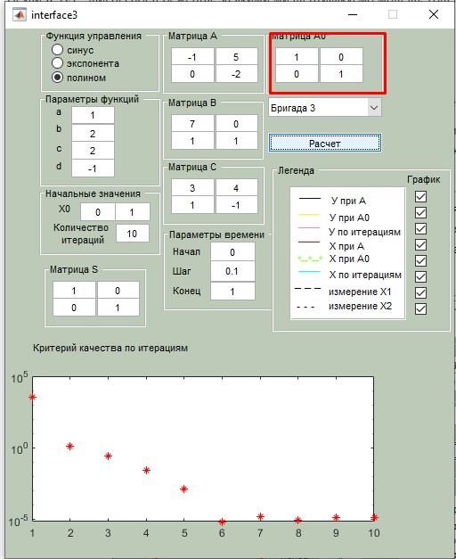
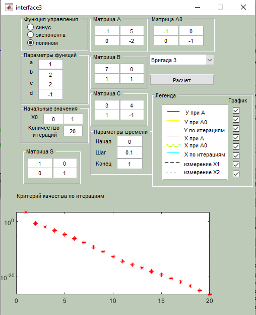
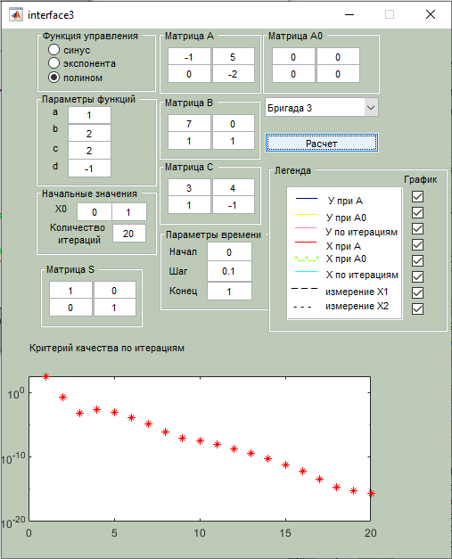
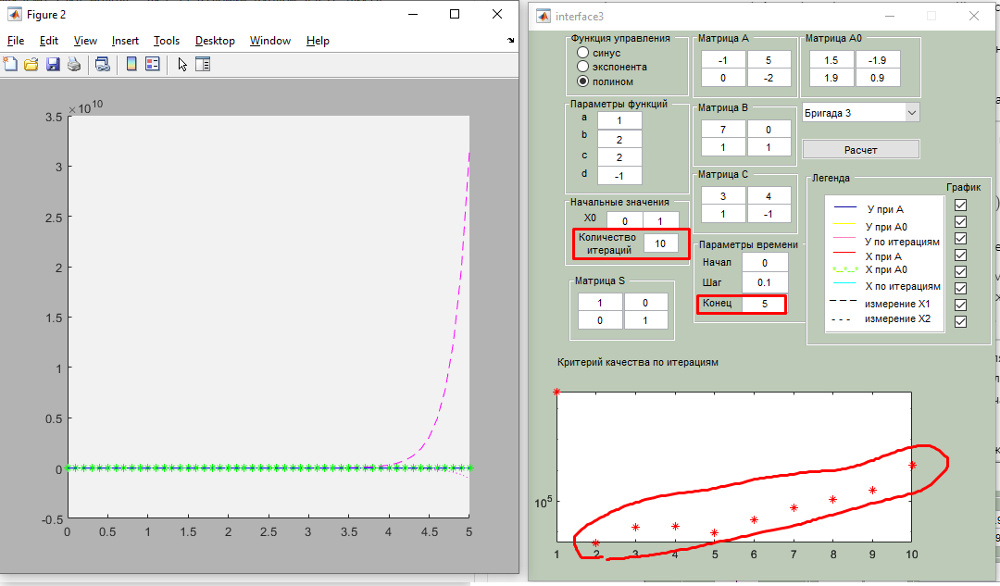
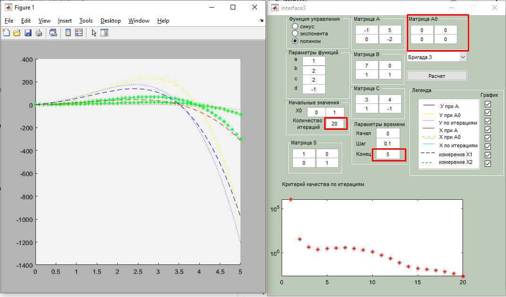

# Теорія керування: лабораторні роботи

**Михайло Корешков, ФІ-91**

## Лабораторна робота 3.  Дослідження алгоритму параметричної ідентифікації об’єктів керування
**Варіант 3**

**Мета:** Познайомитися з методами параметричної ідентифікації.

---

**Параметрична ідентифікація** системи - це, по суті, пошук елементів матриці $A$ (всіх, чи деяких) за відомим спостереженням $y(t)$. Але ідентифіковувати можна не лише лінійні системи - все машинне навчання та нейронні мережі це, в деякому роді, методи ідентифікації складних нелінійних систем. Так чи інакше задача параметричної ідентифікації зводиться до задачі оптимізації. Тут також необхідно ввести функцію помилки (критерій якості моделі) - це дасть нам можливість відрізняти, наскільки знайдена модель є близькою до еталонної. 

Ідентифікація моделей в першу чергу потрібна щоб мати можливість моделювати складні дійсні процеси. Більшість процесів занадто складні, щоб був сенс будувати модель з фундаментальних принципів (напр. з законів механіки Ньютона). Більш ефективно буде побудувати менш точну, але простішу модель - як по часовим витратам, так і по об'ємам обчислювальних потужностей, які необхідно буде використовувати для аналізу цієї моделі.

З іншого боку, чисельні алгоритми ідентифікації систем керування дають можливість будувати автоматичні системи керування, що самостійно підлаштовуються до якісних змін в умовах роботи. 

Існує декілька принципово різних методів ідентифікації:
1. За помилкою виходу  
    Найбільш зрозуміла схема. Шукаємо таку модель, яка за відомим входом дасть вихід, найближчий до дійсних спостережень
2. За помилкою входу  
    Інвертована схема. Шукаємо модель, яка у якості керуючого впливу приймає дійсні спостереження, а у якості виходу видаватиме дані, близькі до відомого керування дійсної системи
3. За узагальненою похибкою.  
    Це найскладніша схема, в якій будуються одночасно дві вищеперелічені моделі із комбінованою функцією помилки.

У цій лабораторній роботі ми використовуємо першу схему - ідентифікація за помилкою виходу.

---

Нехай $y^*(t)$ - дійсні спостереження, за якими ми ідентифікуємо модель. Тоді покладемо функцію помилки $J(A)$ як
$$J(A) = \int_{t_1}^{t_2} \left(y(t)-y^*(t)\right)^T S \left(y(t)-y^*(t)\right) dt$$
Тут $A$ - це параметри моделі, якість якої ми оцінюємо, а $y(t)$ - це спостереження цієї моделі.

Бачимо, що насправді підінтегральний вираз - це квадратична форма від помилки виходу із матрицею $S$. Матриця $S$ задає вагу кожного компоненту виходу системи: деякі виходи можуть бути важливішими, ніж інші, отож ідентифікувати систему варто в першу чергу орієнтуючись саме на них.

---

В цій лабораторній роботі ми використовуємо метод "функції чутливості". Для нього, як і для більшості інших методів оптимізації, необхідні деякі початкові дані - перша здогадка про вигляд матриці $A$, з якої наш ітераційний алгоритм почне пошук найкращого набору параметрів. Цим початковим значенням $A$ тут є параметр $A0$. 

Варто зазначити, що метод функції чутливості не гарантує збіжність, що і можна одразу побачити збільшивши кількість ітерацій без змін інших параметрів:

Також варто спробувати різні A0 - алгоритми оптимізації відомі проблемою застрягання в локальних екстремумах.
- Початкові параметри:  
    
- Одинична A0  
      
    бачимо, що працює краще
- A0, близька до дійсної (вважаю, що на швидкість збіжності в тому числі впливає розподіл власних чисел)  
      
    бачимо, що працює ще краще
- Нульова A0 - ніяких передбачень на початку  
      
    бачимо, що працює добре, що приємно. Значить, алгоритм має сенс використовувати навіть не знаючи про модель нічого.

На результати суттєво впливають межі інтегрування - при збільшенні від 1 до 5 бачимо, що алгоритм працює ще гірше, ніж за початкових параметрів. 

Але зануливши А0 вже маємо дуже приємний результат з малою помилкою:

---

В цілому, бачимо, що кількість ітерацій сильно залежить від параметрів часу, та початкової матриці. Іноді достатньо 5-ти ітерацій, іноді на 20-й ітерації ще видно прогрес. 

Також цікаво, що тренд зміни помилки моделі часто експоненційний, що виражається в лінійних залежностях на графіках (бо вісь ординат має логарифмічну шкалу).
