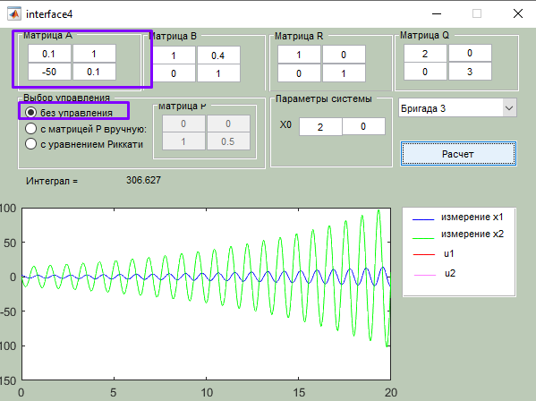

Теорія керування: лабораторні роботи

**Михайло Корешков, ФІ-91**

# Лабораторна робота 4. ДОСЛІДЖЕННЯ СИСТЕМ КЕРУВАННЯ ІЗ ЗВОРОТНИМ ЗВ’ЯЗКОМ
**Варіант 3**

**Мета:** Познайомитися з поняттям оптимальності систем із зворотнім зв'язком та методами пошуку оптимальних параметрів для них.

---

В цій лабораторній ми маємо справу із системою автоматичного керування із лінійним зворотнім зв'язком та методом знаходження його коефіцієнту за допомогою Linear Quadratic Regulator. 

Нам достатньо дослідити лише здатність системи до регуляції до нуля, бо інші системи можна звести до такої.

Система із лінійним зворотнім зв'язком виражається наступним чином
$$\frac{d}{dt}\vec x(t) = Ax(t) + B\vec u(t)$$
$$\vec u(t) = -K\vec x(t)$$

Але "оптимальність" формально все ще не визначена. Один зі способів її визначення - через інтеграл від суми двох квадратичних форм:
$$J = \int_0^\infty \left(x^TQx + u^TRu\right)dt$$

$R$ накладає обмеження на величину керуючого імпульса (ці ваги відповідають, наприклад, вартості ресурсів чи потужності актуаторів). 
$Q$ задає вагу на відхилення стану від положення рівноваги; виходить, що вона відповідає бажаній швидкості повернення системи до рівноваги.

В результати оптимізації ми отримаємо матрицю $K$, що мінімізує цей інтеграл; тобто система стає достатньо жорсткою, але бережливою до ресурсів.

> LQR: Linear від лінійності зворотнього зв'язку, Quadratic бо ми використовуємо квадратичні форми.

Матрицю $K$ можна знаходити загальними gradient descent методами, можна спеціалізованими ітеративними алгоритмами. А можна вивести аналітичними методами так зване рівняння Рікатті (матричне, диференціальне), з якого дістати матрицю $P$.
$$K = R^{-1}B^TP(t)$$

## 1. Інтерфейс
   
- червоне - задання системи
- синє - задання вагів
- зелене - вибір режиму роботи
    - "без керування" для дослідження вільного руху системи
    - "вручну" для ручного задання матриці $P$
    - "з рівнянням Рікатті" для автоматичного пошуку оптимального розв'язку

### 2. Вільний рух
За вільним рухом бачимо систему, схожу на damped гармонійний осцилятор (напр. маса на пружині в густому сиропі)

Що важливо - система стійка, тобто наш оптимальний регулятор впливатиме лише на характер руху до нуля, а не на стабільність.

## 3. Довільна $P$

1. 
Інтеграл малий, повертаємось до нуля швидше.

2. 
Інтеграл виріс через велику амплітуду керуючого впливу, але система повернулась до нуля значно швидше. Тут бачимо поведінку схожу на overdumped осцилятор, тобто такий, у якого залишається лише дійсна від'ємна експонента замість комплексної

3. 
Інтеграл навіть менше першого. Тут ми керуємо обома змінними стану, а не однією, як в першому пункті.

4. 
А тут бачимо, що неправильним регулятором можна також і вивести систему з рівноваги. Тепер оболонка руху системи - додатня експонента, і вона прямує на нескінченність.

## 4. Оптимальна $P$
1. Маємо оптимальну $P$ за даних умов:
    $$P = \begin{pmatrix}7.31025 & -0.56982 \\ -0.56982 & 0.37452\end{pmatrix}$$
    $$K = \begin{pmatrix}7.3102 & -0.5698 \\
    2.3543 & 0.1466\end{pmatrix}$$

    

    Система гальмує значно швидше та використовує при цьому значно менші амплітуди $u(t)$.

2. Збільшімо вартість керуючого впливу
    
    Інтеграл зріс, повернення до рівноваги уповільнилось, вплив став таким незначним, що різниця з вільним рухом несуттєва

3. Збільшимо вартість керуючого вливу не рівномірно
    Найбільша амплітуда у першого впливу. Збільшимо його вартість.  
    
    Тепер керуємо практично повністю другим, але слабо.  

    Зменшимо вартість другого впливу
      
    бачимо, що можемо швидко повертати систему до рівноваги ще й другим впливом, без першого.

4. Зменшимо вартість керуючого впливу
    
    Природньо, система швидше стабілізується.

5. Як би я не зменшував в матриці $Q$ вагу $x_1$ на користь $x_2$ (тобто, просив швидше зменшити другу координату стану, навіть за рахунок прешої), система відчуває, що друга координата швидко зменшується вслід за першою і все одно намагаєтсья регулювати першу в першу чергу.

## 5. Зміна моделі
Хочу побудувати нестійкий осцилятор. 
$A$ тоді має мати власні значення приблизно $a \pm bi, a>0$, що відповідає Характеристичному поліному $(x-a)^2 + b^2 $, а отже і матриці виду 
$$A = \begin{pmatrix}a & -1 \\ b & a\end{pmatrix}$$

Найбільш приємно виглядають парметри $a,b$ такі, що $b / a \approx 500$

Таку нестійку систему також можна регулювати. Власне, поведінка мало чим відрізняється від регулювання стійкої системи. Просто тепер треба спочатку компенсувати власний нестійкий рух.

---

Додаткові матеріали, використані при підготовці
- https://www.youtube.com/watch?v=1_UobILf3cc&list=PLMrJAkhIeNNR20Mz-VpzgfQs5zrYi085m&index=14&ab_channel=SteveBrunton