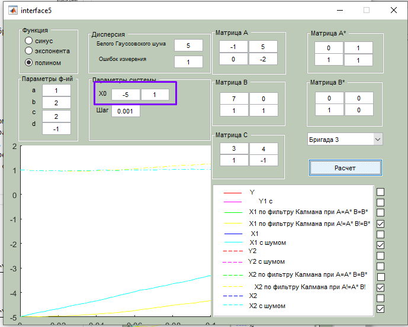
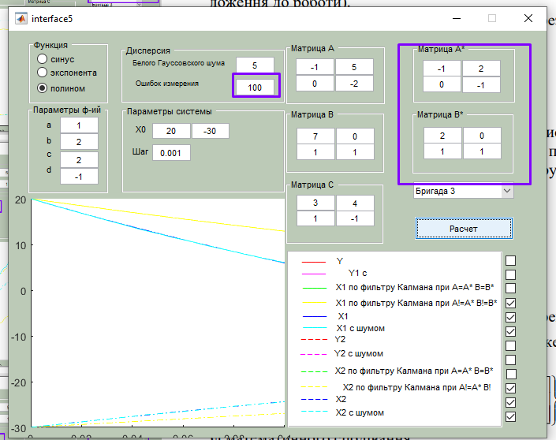

Теорія керування: лабораторні роботи

**Михайло Корешков, ФІ-91**

# Лабораторна робота 5. ДОСЛІДЖЕННЯ АЛГОРИТМУ ОПТИМАЛЬНОГО ОЦІНЮВАННЯ СТАНІВ СТОХАСТИЧНИХ ПРОЦЕСІВ
**Варіант 3**

**Мета:** Познайомитись із методом роботи з системами, в яких неможливо безпосередньо спостерігати змінні стану. Познайомитись із методом оптимального керування для такої ситуації

---

В реальності неможливо спостерігати всі стани $\vec x$ системи безпосередньо. Це може бути неможливо, наприклад, з фізичнихх чи інженерних міркувань або бо змінних стану занадто багато. Тоді необхідно визначити їх опосередковано, через змінні спостереження $\vec y$. Розмірність $\vec y$ зазвичай менша за розмірність $\vec x$, а самі змінні спостереження можуть не відповідати конкретним змінним стану.

Для таких випадків для побудови регулятора (в тому числі і оптимального) використовується додаткова система-спостерігач, яка на вхід приймає все що відомо про головну систему, всередині намагається її відтворити, а на виході видає припущення щодо дійсних значень стану головної системи.   
Далі ця _оцінка_ може бути використана як, наприклад, вхід для LQR. 

В цій роботі ми маємо справу із фільтром Калмана, випадковими збуреннями стану системи $x$, та випадковими помилками вимірювання в $y$.

Фільтр Калмана - це метод оцінки (estimation) стану системи за керуванням $u$, спостереженням $y$, припущеннями про структуру системи та характер шуму.

Для цього фільтра потрібно зробити деякі припущення щодо структури головної системи (матриці $A,B,C$). Це будуть матриці $A^*, B^*, C^*$ фільтра. 
А для "навчання" фільтра ми можемо вбудувати в нього свій лінійний зворотній зв'язок від величини похибки припущених та дійсних спостережень
$$\frac{d}{dt}\hat x = A^* \hat x + B^* u + K_f \left(\hat y - y\right)$$  
$$\hat y = C^*\hat x$$

Оптимальний коефіцієнт зворотнього зв'язку для цієї системи з зірочкою можна знайти, наприклад, вже відомим методом LQR.

## 1. Перший погляд та ідеальний фільтр Калмана

   
Отже, система спостережувана та контрольовна

---

Тут фільтр Калмана має правильно задані $A, B, C$, рівні матрицям основної системи.  

> Можна було також задати матриці з зірочками вручну, але використати графіки з приміткою "A=A* B=B*" зручніше 

  
Тут дві системи розвиваються паралельно за однаковими законами руху. Звісно, траекторії будуть близькі, що і бачимо

  
Для від'ємних значень стану збурення впливають сильніше. Але зважаючи на величину шуму, все одно оцінка стану задовільна

## 2. Зміна початкового стану (для A=A* B=B*)

Бачимо, що все одно естимація добра.

## 3. A!=A* B!=B*

Бачимо, що за близьких значень компонентів початкового стану фільтр дає неправильні оцінки. Я вважаю, що це через те, що в цьому випадку важко правильно передбачити значення окремих компонент за їх сумішшю в спостереженнях.

У випадку відношення між компонентами далекого від $1$, прогнози іноді стають краще. Але не завжди.

## 3. Близькі A,B та A*,B*

Із близькими за формою матрицями естимація проходить значно краще. Але все ще залишається залежність від початкових координат

## 4. Вплив шуму
1. Шум достатньої дисперсії виводить систему фільтра з рівноваги (Але не системи!) та якісно змінює його траекторію руху. Через це фільтр перестає давати валідні оцінки. І це не поодинокий випадок, а типова ситуація, навіть для різних початкових станів.  

    
    
    
    
    

2. Помилки вимірювання не впливають на фільтр із правильними параметрами системи (A=A*, B=B*)

    
    
    
    
    
    Це, в принципі, узгоджується із властивостями оптимальних лінійних регуляторів.

3. Помилки вимірювання впливають на фільтр із неправильними параметрами системи

    
    
    

---

Додаткові матеріали, використані при підготовці
- https://www.youtube.com/watch?v=MZJMi-6_4UU&list=PLMrJAkhIeNNR20Mz-VpzgfQs5zrYi085m&index=17&ab_channel=SteveBrunton
- https://www.youtube.com/watch?v=s_9InuQAx-g&list=PLMrJAkhIeNNR20Mz-VpzgfQs5zrYi085m&index=19&ab_channel=SteveBrunton