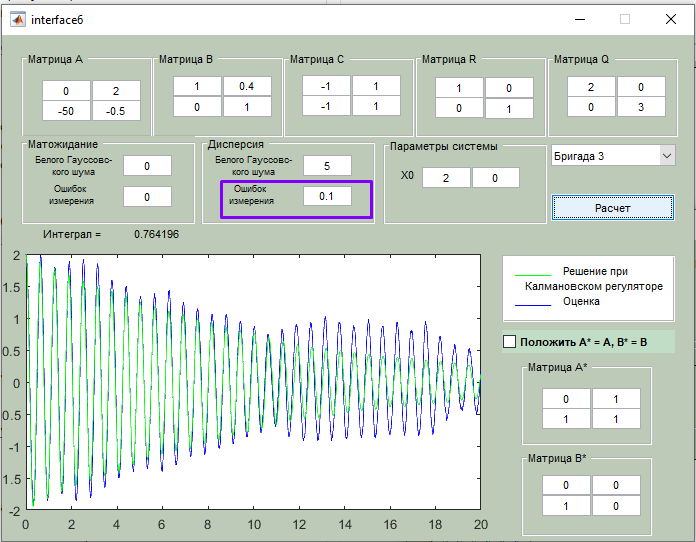

# Теорія керування: лабораторні роботи

**Михайло Корешков, ФІ-91**

## Лабораторна робота 6.  ДОСЛІДЖЕННЯ АЛГОРИТМУ ОПТИМАЛЬНОГО КЕРУВАННЯ СТОХАСТИЧНИМИ ПРОЦЕСАМИ
**Варіант 3**

**Мета:** Познайомитися з застосуванням фільтра Калмана в парі з із оптимальним лінійним регулятором для оцінки та регулювання системи із невідомим явно станом

**Це продовження роботи номер 5**

---

З теорії тут особливо нічого нового. Беремо оцінку стану з фільтра Калмана та використовуємо як вхід регулятора. Коефіцієнт регулятора знаходимо як зазвичай.

### 1. Система
З матриці А видно, що система без регулятора є нестійкою. Отож можна спробувати вивести її з рівноваги.

### 2. Початкові налаштування  

Звісно, шум впливає, але оцінка та регулювання все одно задовільні.

<!-- > Тут я помітив, що, судячи з усього, кнопка "покласти А=А*,В=В*" працює неналежним чином. Матриці рівні якщо кнопка *не* натиснута - треба ще раз перевірити -->

### 3. Вплив шуму. Збурення стану.

До певного моменту регулювання все ще відбувається, проте оцінка, звісно, стає невалідною. Після деякої величини шуму, шум стає більшим за типові значення системи і оцінка втрачає сенс.

### 4. Вплив шуму. Помилка вимірювань

1. З малою похибкою вимірювань зростає чутливість до збурень стану. Оцінки погіршуються, проте регуляція працює. Навіть із ненульовим маточікуванням  
    
    

2. Із великою (із дисп. до 100) похибкою оцінки також втрачають сенс, але регуляція також працює  
    
    
    
    
    

