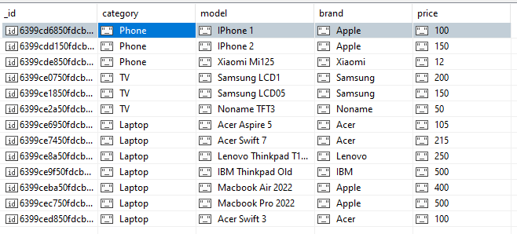
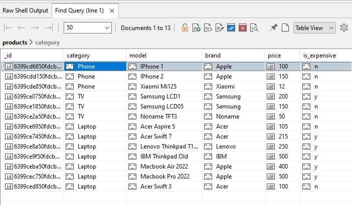
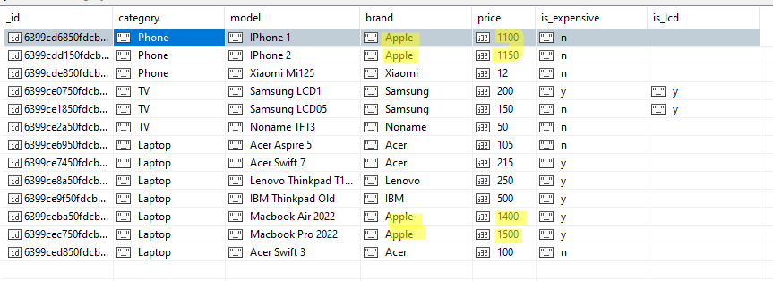

# 7-Highload. Lab3. Part 1
Mykhailo Koreshkov, FI-91


1)
```
> use lab3
switched to db lab3
```
```
> db.products.insertOne({
    "category": "Phone",
    "model": "IPhone 1",
    "brand": "Apple",
    "price": "100"
})
{
  acknowledged: true,
  insertedId: ObjectId("6399cd6850fdcb1fb0f804c1")
}
```
... тут багато інших подібних запитів ...

2) запит всіх документів колекції:
```
> db.products.find({})
```


json:
```json
{
    "_id" : ObjectId("6399cd6850fdcb1fb0f804c1"),
    "category" : "Phone",
    "model" : "IPhone 1",
    "brand" : "Apple",
    "price" : "100"
}
...
{
    "_id" : ObjectId("6399ced850fdcb1fb0f804cd"),
    "category" : "Laptop",
    "model" : "Acer Swift 3",
    "brand" : "Acer",
    "price" : "100"
}
```

3) Підрахунок кількості товарів категорії
```
> db.products.countDocuments({"category": "Laptop"})
7
> db.products.countDocuments({"category": "Phone"})
3
> db.products.countDocuments({"category": "TV"})
3
```

4) Кількість різних категорій
```
> db.products.distinct("category")
[ 'Laptop', 'Phone', 'TV' ]

> db.products.distinct("category").length
3
```

5) Різні бренди без повторів
```
> db.products.distinct("brand")
[
  'Acer',   'Apple',
  'IBM',    'Lenovo',
  'Noname', 'Samsung',
  'Xiaomi'
]
```

6) Запити з умовами  
> тут я помітив, що в мене поле price текстове

```
> db.products.find({}).forEach((x)=>{
    db.products.updateOne({_id: x._id }, { $set: { price: parseFloat(x.price) }})
})

> db.products.find({})
{
    "_id" : ObjectId("6399cd6850fdcb1fb0f804c1"),
    "category" : "Phone",
    "model" : "IPhone 1",
    "brand" : "Apple",
    "price" : NumberInt(100)
}
...
```
Тепер все ок - поле числове

а) Знайти всі ноутбуки з ціною від 100 до 300
```
> db.products.find({
    category: "Laptop",
    price: { $gt: 100, $lt: 300 }
})
{
    "_id" : ObjectId("6399ce6950fdcb1fb0f804c7"),
    "category" : "Laptop",
    "model" : "Acer Aspire 5",
    "brand" : "Acer",
    "price" : NumberInt(105)
}
{
    "_id" : ObjectId("6399ce7450fdcb1fb0f804c8"),
    "category" : "Laptop",
    "model" : "Acer Swift 7",
    "brand" : "Acer",
    "price" : NumberInt(215)
}
{
    "_id" : ObjectId("6399ce8a50fdcb1fb0f804c9"),
    "category" : "Laptop",
    "model" : "Lenovo Thinkpad T14s",
    "brand" : "Lenovo",
    "price" : NumberInt(250)
}
```

б) Знайти одну або іншу модель
```
> db.products.find({
    $or: [{model: "IPhone 1"}, {model:"IPhone 2"}]
})
{
    "_id" : ObjectId("6399cd6850fdcb1fb0f804c1"),
    "category" : "Phone",
    "model" : "IPhone 1",
    "brand" : "Apple",
    "price" : NumberInt(100)
}
{
    "_id" : ObjectId("6399cdd150fdcb1fb0f804c2"),
    "category" : "Phone",
    "model" : "IPhone 2",
    "brand" : "Apple",
    "price" : NumberInt(150)
}
```

в) Знайти продукти виробників з переліку
```
> db.products.find({
    brand: {$in: ["Apple", "Lenovo"]}
})
{
    "_id" : ObjectId("6399cd6850fdcb1fb0f804c1"),
    "category" : "Phone",
    "model" : "IPhone 1",
    "brand" : "Apple",
    "price" : NumberInt(100)
}
{
    "_id" : ObjectId("6399cdd150fdcb1fb0f804c2"),
    "category" : "Phone",
    "model" : "IPhone 2",
    "brand" : "Apple",
    "price" : NumberInt(150)
}
{
    "_id" : ObjectId("6399ce8a50fdcb1fb0f804c9"),
    "category" : "Laptop",
    "model" : "Lenovo Thinkpad T14s",
    "brand" : "Lenovo",
    "price" : NumberInt(250)
}
{
    "_id" : ObjectId("6399ceba50fdcb1fb0f804cb"),
    "category" : "Laptop",
    "model" : "Macbook Air 2022",
    "brand" : "Apple",
    "price" : NumberInt(400)
}
{
    "_id" : ObjectId("6399cec750fdcb1fb0f804cc"),
    "category" : "Laptop",
    "model" : "Macbook Pro 2022",
    "brand" : "Apple",
    "price" : NumberInt(500)
}
```

7.1) Оновити поле за певним критерієм

```
> db.products.updateMany(
  {}, [{
    $set: {
      is_expensive: {
        $cond: {
          if: { $gte: ["$price", 200] },
          then: 'y',
          else: 'n'
        } 
      }
    }
  }]
)
{
    "acknowledged" : true,
    "insertedId" : null,
    "matchedCount" : 13.0,
    "modifiedCount" : 13.0,
    "upsertedCount" : 0.0
}

> db.products.find({})
```



7.2) Додати поле за певним критерієм

```
> db.products.updateMany(
  {category: "TV", model: { $regex: /LCD/ }},
  {
    $set: {
      is_lcd: "y"
    }
  }
)
{
    "acknowledged" : true,
    "insertedId" : null,
    "matchedCount" : 2.0,
    "modifiedCount" : 2.0,
    "upsertedCount" : 0.0
}
```

8) Знайти записи у яких присутнє поле

```
> db.products.find({is_lcd:{$exists: 1}})
{
    "_id" : ObjectId("6399ce0750fdcb1fb0f804c4"),
    "category" : "TV",
    "model" : "Samsung LCD1",
    "brand" : "Samsung",
    "price" : NumberInt(200),
    "is_expensive" : "y",
    "is_lcd" : "y"
}
{
    "_id" : ObjectId("6399ce1850fdcb1fb0f804c5"),
    "category" : "TV",
    "model" : "Samsung LCD05",
    "brand" : "Samsung",
    "price" : NumberInt(150),
    "is_expensive" : "n",
    "is_lcd" : "y"
}
```

9) Збільшити ціну певних товарів
```
>db.products.updateMany(
  { brand: "Apple" },
  {
    $inc: { price: 1000 }
  }
)
{
    "acknowledged" : true,
    "insertedId" : null,
    "matchedCount" : 4.0,
    "modifiedCount" : 4.0,
    "upsertedCount" : 0.0
}

> db.products.find({})
```
