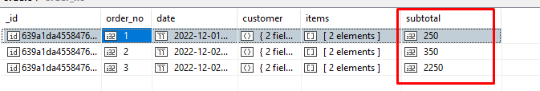
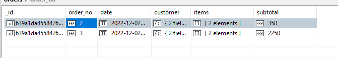
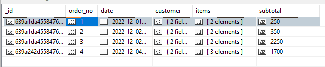
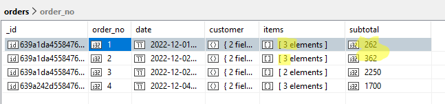
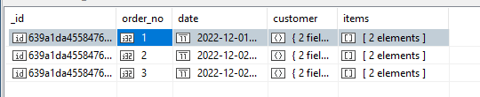
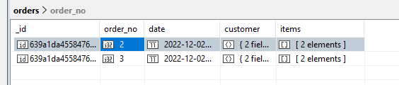
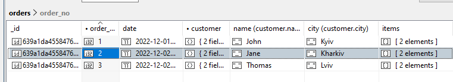
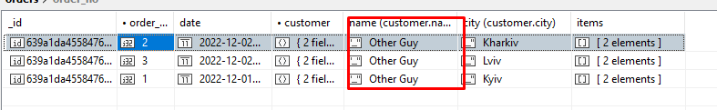
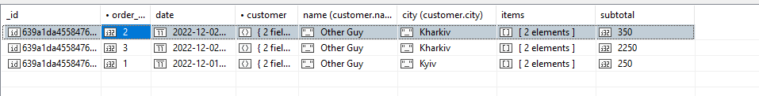

# 7-Highload. Lab3. Part 2
Mykhailo Koreshkov, FI-91

1) Додати замовлення
```
> use admin;
db.orders.deleteMany({});
db.orders.insertMany([
{
  order_no: 1,
  date: ISODate("2022-12-01"),
  customer: {
    name: "John",
    city: "Kyiv"
  },
  items: [
    ObjectId("6399ced850fdcb1fb0f804cd"),
    ObjectId("6399ce1850fdcb1fb0f804c5"),
  ]
},
{
  order_no: 2,
  date: ISODate("2022-12-02"),
  customer: {
    name: "Jane",
    city: "Kharkiv"
  },
  items: [
    ObjectId("6399ced850fdcb1fb0f804cd"),
    ObjectId("6399ce8a50fdcb1fb0f804c9"),
  ]
},
{
  order_no: 3,
  date: ISODate("2022-12-02"),
  customer: {
    name: "Thomas",
    city: "Lviv"
  },
  items: [
    ObjectId("6399cd6850fdcb1fb0f804c1"),
    ObjectId("6399cdd150fdcb1fb0f804c2"),
  ]
}
])
```

2) Всі замовлення
```
> db.orders.find({})
{
    "_id" : ObjectId("639a1da4558476bb305d97fd"),
    "order_no" : NumberInt(1),
    "date" : ISODate("2022-12-01T00:00:00.000+0000"),
    "customer" : {
        "name" : "John",
        "city" : "Kyiv"
    },
    "items" : [
        ObjectId("6399ced850fdcb1fb0f804cd"),
        ObjectId("6399ce1850fdcb1fb0f804c5")
    ]
}
{
    "_id" : ObjectId("639a1da4558476bb305d97fe"),
    "order_no" : NumberInt(2),
    "date" : ISODate("2022-12-02T00:00:00.000+0000"),
    "customer" : {
        "name" : "Jane",
        "city" : "Kharkiv"
    },
    "items" : [
        ObjectId("6399ced850fdcb1fb0f804cd"),
        ObjectId("6399ce8a50fdcb1fb0f804c9")
    ]
}
{
    "_id" : ObjectId("639a1da4558476bb305d97ff"),
    "order_no" : NumberInt(3),
    "date" : ISODate("2022-12-02T00:00:00.000+0000"),
    "customer" : {
        "name" : "Thomas",
        "city" : "Lviv"
    },
    "items" : [
        ObjectId("6399cd6850fdcb1fb0f804c1"),
        ObjectId("6399cdd150fdcb1fb0f804c2")
    ]
}
```

2.2) Обчислити вартість замовлень
Я виконав це не вручну, а за допомогою aggregation pipelines.
Ось демонстрація роботи пайплайну:
```
> a = db.orders.aggregate([
  {
    $lookup: {
      from: "products",
      localField: "items",
      foreignField: "_id",
      as: "items_obj"
    }
  },
  {
    $project: {
      subtotal: {
        $reduce: {
          input: "$items_obj",
          initialValue: 0,
          in: { $add: ["$$value", "$$this.price"]}
        }
      }
    }
  }
]); a
{
    "_id" : ObjectId("639a1da4558476bb305d97fd"),
    "subtotal" : 250.0
}
{
    "_id" : ObjectId("639a1da4558476bb305d97fe"),
    "subtotal" : 350.0
}
{
    "_id" : ObjectId("639a1da4558476bb305d97ff"),
    "subtotal" : 2250.0
}

> a.forEach((x)=>{
  db.orders.updateOne({_id:x._id}, {$set: {subtotal: x.subtotal}})
})

> db.orders.find({})
```


3) Виведіть замовлення з вартістю більше певного значення
```
> db.orders.find({subtotal: {$gt: 300}})
```


4) Знайдіть замовлення зроблені одним замовником
4.1) Додаємо ще замовлення, щоб було від одного замовника
```
> db.orders.insertOne({
  "order_no" : NumberInt(4),
  "date" : ISODate("2022-12-04"),
  "customer" : {
      "name" : "Jane",
      "city" : "Kharkiv"
  },
  "items" : [
      ObjectId("6399ce2a50fdcb1fb0f804c6"),
      ObjectId("6399ce1850fdcb1fb0f804c5"),
      ObjectId("6399cec750fdcb1fb0f804cc")
  ]
})

> А також знову запускаю пайплайн для обчислення сум.

> db.orders.find({})
```


4.2) Знайдіть замовлення зроблені одним замовником
```
> db.orders.aggregate([
{
  $group: {
    _id: "$customer",
    orders: {
      $addToSet: "$_id"
    }
  }
}
])
{
    "_id" : {
        "name" : "John",
        "city" : "Kyiv"
    },
    "orders" : [
        ObjectId("639a1da4558476bb305d97fd")
    ]
}
{
    "_id" : {
        "name" : "Jane",
        "city" : "Kharkiv"
    },
    "orders" : [
        ObjectId("639a1da4558476bb305d97fe"),
        ObjectId("639a242d558476bb305d9800")
    ]
}
{
    "_id" : {
        "name" : "Thomas",
        "city" : "Lviv"
    },
    "orders" : [
        ObjectId("639a1da4558476bb305d97ff")
    ]
}
```

5)	Знайдіть всі замовлення з певним товаром (товарами) (шукати можна по ObjectId)   
Наступна команда шукає всі записи, які в полі `items` містять товар 6399ced850fdcb1fb0f804cd (Acer Swift 3)
```
> db.orders.find({
  items: ObjectId("6399ced850fdcb1fb0f804cd")
})
{
    "_id" : ObjectId("639a1da4558476bb305d97fd"),
    "order_no" : NumberInt(1),
    "date" : ISODate("2022-12-01T00:00:00.000+0000"),
    "customer" : {
        "name" : "John",
        "city" : "Kyiv"
    },
    "items" : [
        ObjectId("6399ced850fdcb1fb0f804cd"),
        ObjectId("6399ce1850fdcb1fb0f804c5")
    ],
    "subtotal" : NumberInt(250)
}
{
    "_id" : ObjectId("639a1da4558476bb305d97fe"),
    "order_no" : NumberInt(2),
    "date" : ISODate("2022-12-02T00:00:00.000+0000"),
    "customer" : {
        "name" : "Jane",
        "city" : "Kharkiv"
    },
    "items" : [
        ObjectId("6399ced850fdcb1fb0f804cd"),
        ObjectId("6399ce8a50fdcb1fb0f804c9")
    ],
    "subtotal" : NumberInt(350)
}
```

```
db.orders.updateMany({
  items: ObjectId("6399ced850fdcb1fb0f804cd")
}, {
  $push: {
    items: ObjectId("6399cde850fdcb1fb0f804c3")
  }
}, {
  $inc: {
    subtotal: 12
  }
});
{
    "acknowledged" : true,
    "insertedId" : null,
    "matchedCount" : 2.0,
    "modifiedCount" : 2.0,
    "upsertedCount" : 0.0
}

> db.orders.find({})
```


7)	Виведіть кількість товарів в певному замовленні
```
>db.orders.find({_id: ObjectId("639a1da4558476bb305d97fd")}, {item_count: {$size: "$items"}})
{
    "_id" : ObjectId("639a1da4558476bb305d97fd"),
    "item_count" : NumberInt(3)
}
```

8)	Виведіть тільки інформацію про кастомера і номери кредитної карт, для замовлень вартість яких перевищує певну суму
```
> db.orders.find({subtotal: {$gt: 300}}, {customer: 1, subtotal: 1})
{
    "_id" : ObjectId("639a1da4558476bb305d97fe"),
    "customer" : {
        "name" : "Jane",
        "city" : "Kharkiv"
    },
    "subtotal" : NumberInt(362)
}
{
    "_id" : ObjectId("639a1da4558476bb305d97ff"),
    "customer" : {
        "name" : "Thomas",
        "city" : "Lviv"
    },
    "subtotal" : NumberInt(2250)
}
{
    "_id" : ObjectId("639a242d558476bb305d9800"),
    "customer" : {
        "name" : "Jane",
        "city" : "Kharkiv"
    },
    "subtotal" : NumberInt(1700)
}
```

9)	Видаліть товар з замовлень, зроблених за певний період дат   
> тут я випадково видалив всі дані і перестворив початкову таблицю, тому дані трохи відрізняються від попереднього кроку

```
> db.find({})
```


```
> db.orders.deleteMany({date: {$lt: ISODate("2022-12-02")}})
{
    "acknowledged" : true,
    "deletedCount" : 1.0
}

> db.find({})
```


10) Перейменуйте у всіх замовлення ім'я (прізвище) замовника
```
> db.orders.find({})
```


```
> db.orders.updateMany({}, {$set: { "customer.name": "Other Guy"}})
```


11)	(+2 бали)* Знайдіть замовлення зроблені одним замовником, і виведіть тільки інформацію про кастомера та товари у замовлені підставивши замість ObjectId("***") назви товарів та їх вартість (аналог join-а між таблицями orders та items).

```
> db.orders.find({})
```


```
> db.orders.aggregate([
  {
    $lookup: {
      from: "products",
      localField: "items",
      foreignField: "_id",
      as: "items_obj"
    }
  },
  {
    $project: {
      customer: 1,
      items: {
        $map: {
          input: "$items_obj",
          in: {model: "$$this.model", price: "$$this.price"}
        }
      }
    }
  },
  {
    $group: {
      _id: "$customer",
      orders: {$addToSet: "$items"}
    }
  }
])

{
    "_id" : {
        "name" : "Other Guy",
        "city" : "Kyiv"
    },
    "orders" : [
        [
            {
                "model" : "Acer Swift 3",
                "price" : NumberInt(100)
            },
            {
                "model" : "Samsung LCD05",
                "price" : NumberInt(150)
            }
        ]
    ]
}
{
    "_id" : {
        "name" : "Other Guy",
        "city" : "Kharkiv"
    },
    "orders" : [
        [
            {
                "model" : "Acer Swift 3",
                "price" : NumberInt(100)
            },
            {
                "model" : "Lenovo Thinkpad T14s",
                "price" : NumberInt(250)
            }
        ],
        [
            {
                "model" : "IPhone 2",
                "price" : NumberInt(1150)
            },
            {
                "model" : "IPhone 1",
                "price" : NumberInt(1100)
            }
        ]
    ]
}

```

