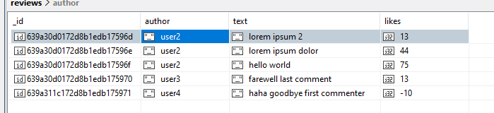

# 7-Highload. Lab3. Part 3
Mykhailo Koreshkov, FI-91

Створіть Сapped collection яка б містила 5 останніх відгуків на наш інтернет-магазин. Структуру запису визначіть самостійно.
1)	Перевірте що при досягненні обмеження старі відгуки будуть затиратись

```
> db.createCollection("reviews", {
  capped: true,
  size: 1000,
  max: 5
})

{ ok: 1 }
```

```
> db.reviews.insertMany([
{
  author: "user1",
  text: "lorem ipsum",
  likes: 125000
},{
  author: "user2",
  text: "lorem ipsum 2",
  likes: 13
},{
  author: "user2",
  text: "lorem ipsum dolor",
  likes: 44
},{
  author: "user2",
  text: "hello world",
  likes: 75
},{
  author: "user3",
  text: "farewell last comment",
  likes: 13
},
])

> db.reviews.find({})
```


```
> db.reviews.insertOne(
{
  author: "user4",
  text: "haha goodbye first commenter",
  likes: -10
})

> db.reviews.find({})
```


