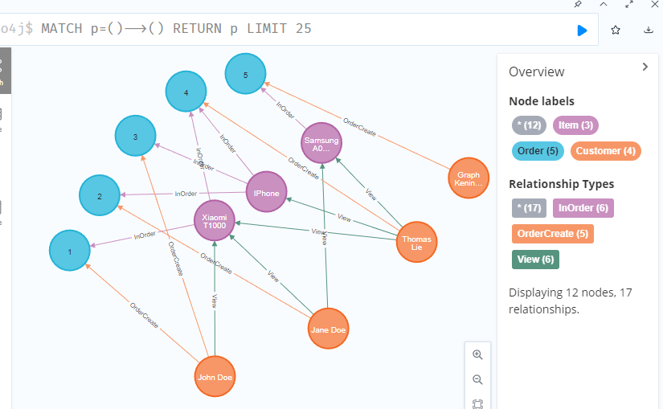

# 7-Highload. Lab4
Mykhailo Koreshkov, FI-91

Додаємо записи
```
> create (a:Item {model:"IPhone", price: 100, brand: "Apple"})
> create (:Item {model:"Xiaomi T1000", price: 80, brand: "Skynet"})
> create (:Item {model:"Samsung Galaxy A0", price: 50, brand: "Samsung"})
> match (n:Item) return n
╒══════════════════════════════════════════════════════════╕
│"item"                                                    │
╞══════════════════════════════════════════════════════════╡
│{"price":100,"model":"IPhone","brand":"Apple"}            │
├──────────────────────────────────────────────────────────┤
│{"price":80,"model":"Xiaomi T1000","brand":"Skynet"}      │
├──────────────────────────────────────────────────────────┤
│{"price":50,"model":"Samsung Galaxy A0","brand":"Samsung"}│
└──────────────────────────────────────────────────────────┘

> create (:Customer {name:"John Doe", phone:"111"})
> create (:Customer {name:"Jane Doe", phone:"112"})
> create (:Customer {name:"Thomas Lie", phone:"222"})
> match (c:Customer) return c
╒═══════════════════════════════════╕
│"c"                                │
╞═══════════════════════════════════╡
│{"phone":"111","name":"John Doe"}  │
├───────────────────────────────────┤
│{"phone":"112","name":"Jane Doe"}  │
├───────────────────────────────────┤
│{"phone":"222","name":"Thomas Lie"}│
└───────────────────────────────────┘

```

Люди дивляться товари

```
> MATCH
(c:Customer WHERE c.name="John Doe"),
(i:Item WHERE i.model="Xiaomi T1000")
CREATE (c)-[r:View]->(i)
RETURN c,r,i

╒═══════════════════════╤═══╤═══════════════════════╕
│"c"                    │"r"│"i"                    │
╞═══════════════════════╪═══╪═══════════════════════╡
│{"phone":"111","name":"│{} │{"price":80,"model":"Xi│
│John Doe"}             │   │aomi T1000","brand":"Sk│
│                       │   │ynet"}                 │
└───────────────────────┴───┴───────────────────────┘

> match 
(c:Customer WHERE c.name="Jane Doe"),
(i:Item WHERE i.model="Xiaomi T1000" or i.brand="Samsung")
create (c)-[r:View]->(i)
return c,r,i

╒═══════════════════════╤═══╤═══════════════════════╕
│"c"                    │"r"│"i"                    │
╞═══════════════════════╪═══╪═══════════════════════╡
│{"phone":"112","name":"│{} │{"price":50,"model":"Sa│
│Jane Doe"}             │   │msung Galaxy A0","brand│
│                       │   │":"Samsung"}           │
├───────────────────────┼───┼───────────────────────┤
│{"phone":"112","name":"│{} │{"price":80,"model":"Xi│
│Jane Doe"}             │   │aomi T1000","brand":"Sk│
│                       │   │ynet"}                 │
└───────────────────────┴───┴───────────────────────┘

> match 
(c:Customer WHERE c.phone="222"),
(i:Item)
create (c)-[r:View]->(i)
return c,r,i

╒═══════════════════════╤═══╤═══════════════════════╕
│"c"                    │"r"│"i"                    │
╞═══════════════════════╪═══╪═══════════════════════╡
│{"phone":"222","name":"│{} │{"price":100,"model":"I│
│Thomas Lie"}           │   │Phone","brand":"Apple"}│
├───────────────────────┼───┼───────────────────────┤
│{"phone":"222","name":"│{} │{"price":80,"model":"Xi│
│Thomas Lie"}           │   │aomi T1000","brand":"Sk│
│                       │   │ynet"}                 │
├───────────────────────┼───┼───────────────────────┤
│{"phone":"222","name":"│{} │{"price":50,"model":"Sa│
│Thomas Lie"}           │   │msung Galaxy A0","brand│
│                       │   │":"Samsung"}           │
└───────────────────────┴───┴───────────────────────┘
```

Люди купують телефони

```
match 
(c:Customer WHERE c.phone="111"), (i:Item WHERE i.brand="Skynet")
create 
(c)-[r1:OrderCreate]->(o:Order {id:1, date:date('2022-12-01')}), 
(i)-[r2:InOrder]->(o)
return c,r1,o,r2,i

- Added 1 label, created 1 node, set 2 properties, created 2 relationships, started streaming 1 records after 347 ms and completed after 437 ms.
```


```
match 
(c:Customer WHERE c.phone="112"), (i:Item WHERE i.brand="Apple")
create 
(c)-[r1:OrderCreate]->(o:Order {id:2, date:date('2022-12-02')}), 
(i)-[r2:InOrder]->(o)

match 
(c:Customer WHERE c.phone="111"), (i:Item WHERE i.brand="Apple")
create 
(c)-[r1:OrderCreate]->(o:Order {id:3, date:date('2022-12-02')}), 
(i)-[r2:InOrder]->(o)

MATCH p=()-->() RETURN p LIMIT 25
```


І ще одне замовлення одразу з двома товарами
```
match 
(c:Customer WHERE c.phone="222")
create 
(c)-[r1:OrderCreate]->(o:Order {id:4, date:date('2022-12-04')})
with c,o,r1
match (i:Item WHERE i.brand="Apple" or i.brand="Skynet")
create 
(i)-[r2:InOrder]->(o)
return c,r1,o,r2,i
```


1. Знайти Items які входять в конкретний Order
```
match (i:Item)-->(o:Order where o.id=1) return i
╒════════════════════════════════════════════════════╕
│"i"                                                 │
╞════════════════════════════════════════════════════╡
│{"price":80,"model":"Xiaomi T1000","brand":"Skynet"}│
└────────────────────────────────────────────────────┘

match (i:Item)-->(o:Order where o.id=2) return i
╒══════════════════════════════════════════════╕
│"i"                                           │
╞══════════════════════════════════════════════╡
│{"price":100,"model":"IPhone","brand":"Apple"}│
└──────────────────────────────────────────────┘

match (i:Item)-->(o:Order where o.id=4) return i
╒════════════════════════════════════════════════════╕
│"i"                                                 │
╞════════════════════════════════════════════════════╡
│{"price":80,"model":"Xiaomi T1000","brand":"Skynet"}│
├────────────────────────────────────────────────────┤
│{"price":100,"model":"IPhone","brand":"Apple"}      │
└────────────────────────────────────────────────────┘
```

2. Підрахувати вартість конкретного Order
```
match (i:Item)-->(o:Order where o.id=4) return sum(i.price) as subtotal
╒══════════╕
│"subtotal"│
╞══════════╡
│180       │
└──────────┘
```

3. Знайти всі Orders конкретного Customer
```
match (c:Customer where c.name starts with "John")-->(o:Order) return o as orders
╒════════════════════════════╕
│"orders"                    │
╞════════════════════════════╡
│{"date":"2022-12-02","id":3}│
├────────────────────────────┤
│{"date":"2022-12-01","id":1}│
└────────────────────────────┘
```

4. Знайти всі Items куплені конкретним Customer (через Order)
```
match 
(c:Customer where c.name starts with "John")-->(o:Order)<--(i:Item)
return i as items
╒════════════════════════════════════════════════════╕
│"items"                                             │
╞════════════════════════════════════════════════════╡
│{"price":100,"model":"IPhone","brand":"Apple"}      │
├────────────────────────────────────────────────────┤
│{"price":80,"model":"Xiaomi T1000","brand":"Skynet"}│
└────────────────────────────────────────────────────┘
```

5. Знайти кількість Items куплені конкретним Customer (через Order)
```
match 
(c:Customer where c.name starts with "John")-->(o:Order)<--(i:Item)
return count(i) as item_number
╒═════════════╕
│"item_number"│
╞═════════════╡
│2            │
└─────────────┘
```

6. Знайти для Customer на яку суму він придбав товарів (через Order)
```
match 
(c:Customer where c.name starts with "John")-->(o:Order)<--(i:Item)
return sum(i.price) as total_spent
╒═════════════╕
│"total_spent"│
╞═════════════╡
│180          │
└─────────────┘
```

7. Знайти скільки разів кожен товар був придбаний, відсортувати за цим значенням
```
create (o:Order {id:5, date:date('2022-12-05')}) with o
match (c:Customer where c.phone="444"),(i:Item where i.brand="Samsung")
create
(c)-[:OrderCreate]->(o),
(i)-[:InOrder]->(o)
```


```
match (i:Item), p=(i)-->(o:Order)
return i.model as item, count(p) as n_ordered
order by n_ordered asc
╒═══════════════════╤═══════════╕
│"item"             │"n_ordered"│
╞═══════════════════╪═══════════╡
│"Samsung Galaxy A0"│1          │
├───────────────────┼───────────┤
│"Xiaomi T1000"     │2          │
├───────────────────┼───────────┤
│"IPhone"           │3          │
└───────────────────┴───────────┘
```

8. Знайти всі Items переглянуті (view) конкретним Customer
```
match (i:Item)<-[:View]-(c:Customer where c.phone="112")
return i as viewed_items
╒══════════════════════════════════════════════════════════╕
│"viewed_items"                                            │
╞══════════════════════════════════════════════════════════╡
│{"price":50,"model":"Samsung Galaxy A0","brand":"Samsung"}│
├──────────────────────────────────────────────────────────┤
│{"price":80,"model":"Xiaomi T1000","brand":"Skynet"}      │
└──────────────────────────────────────────────────────────┘
```

9. Знайти інші Items що купувались разом з конкретним Item (тобто всі Items що входять до Order-s разом з даними Item)
```
match 
(a:Item)-->(o:Order),
(b:Item)-->(o)
return a,b,o
```


10. Знайти Customers які купили даний конкретний Item
```
match 
(a:Item where a.brand="Apple")-->(o:Order)<--(c:Customer)
return c,a,o
(або return c щоб отримати лише покупців)
```


11. Знайти для певного Customer(а) товари, які він переглядав, але не купив

ще раз подивімося граф 


```
match (a:Item)<-[v:View]-(c:Customer)
where not (a)-->(:Order)<--(c)
return c,a
```

