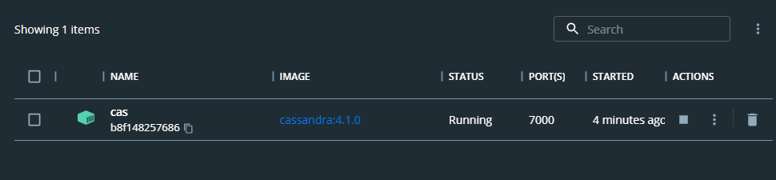

# 7-Highload. Lab5.
Mykhailo Koreshkov, FI-91


0. Підняв касандру в докері


1. Створення keyspace
```
cqlsh> CREATE KEYSPACE lab5 WITH replication =
   ...   {'class': 'SimpleStrategy', 'replication_factor' : 3};

Warnings :
Your replication factor 3 for keyspace lab5 is higher than the number of nodes 1
```

2. Створення схеми даних

В Cassandra необхідно приділити увагу схемі даних. 
Ця БД запито-орієнтовна, тобто проектувати будемо від запитів.

2.0. Необхідно, щоб пошук швидко працював для визначеної категорії товарів
Робимо ключем категорію

2.1. усі товари в певній категорії відсортовані за ціною
Робимо ключем ціну (після категорії).
Якщо поставити ціну ключем до категорії, то, наприклад, не вийде шукати товари в певному ціновому діапазоні та певній категорії.

2.2. Характеристики як map
Візьму `map<ascii,text>`, бо з ascii текстом легше працювати в коді, а більше для ключів мені і не потрібно.

```
CREATE TABLE lab5.products ( 
    category ascii, 
    sku int, 
    name text, 
    brand text, 
    features map<ascii, text>, 
    price float, 
    PRIMARY KEY ((category), price) 
);
```

3. Describe
```
cqlsh:lab5> describe products

CREATE TABLE lab5.products (
    category ascii,
    price float,
    brand text,
    name text,
    sku int,
    features map<ascii, text>,
    PRIMARY KEY (category, price)
) WITH CLUSTERING ORDER BY (price ASC)
    AND additional_write_policy = '99p'
    AND bloom_filter_fp_chance = 0.01
    AND caching = {'keys': 'ALL', 'rows_per_partition': 'NONE'}
    AND cdc = false
    AND comment = ''
    AND compaction = {'class': 'org.apache.cassandra.db.compaction.SizeTieredCompactionStrategy', 'max_threshold': '32', 'min_threshold': '4'}
    AND compression = {'chunk_length_in_kb': '16', 'class': 'org.apache.cassandra.io.compress.LZ4Compressor'}
    AND memtable = 'default'
    AND crc_check_chance = 1.0
    AND default_time_to_live = 0
    AND extensions = {}
    AND gc_grace_seconds = 864000
    AND max_index_interval = 2048
    AND memtable_flush_period_in_ms = 0
    AND min_index_interval = 128
    AND read_repair = 'BLOCKING'
    AND speculative_retry = '99p';
```

Insert

```
cqlsh> insert into lab5.products 
(sku, category, price, brand, name, features) values 
(100, 'Phone', 100, 'Apple', 'IPhone 1', {'cpu':'A1', 'ram':'1GB'});
...
...
cqlsh:lab5> select * from products;

 category | price | brand      | features                               | name          | sku
----------+-------+------------+----------------------------------------+---------------+-----
    Phone |    85 | ChinaBrand |         {'cpu': 'Xi0', 'ram': '0.1GB'} | ChinaTop 3000 | 103
    Phone |   100 |      Apple |            {'cpu': 'A1', 'ram': '1GB'} |      IPhone 1 | 100
    Phone |   150 |      Apple |            {'cpu': 'A2', 'ram': '2GB'} |      IPhone 2 | 101
    Phone |   200 |    Samsung |           {'cpu': 'S1', 'ram': '50GB'} |      Fold 125 | 102
   Laptop |   100 |        IBM |    {'cpu': 'Intel8086', 'diag': '14"'} |      Thinkpad | 104
   Laptop |   200 |     Lenovo |   {'cpu': 'Ryzen 5600', 'diag': '14"'} | Thinkpad T14s | 105
   Laptop |   300 |      Apple | {'cpu': 'Whatever2000', 'diag': '16"'} |   Macbook Pro | 106
       TV |   100 |         LG |       {'diag': '30"', 'res': 'FullHD'} |        LGTV 1 | 107
       TV |   200 |    Samsung |           {'diag': '35"', 'res': '4K'} |   SamsungTV 1 | 108
       TV |   400 |    Philips |           {'diag': '40"', 'res': '8K'} |     Philips 1 | 109

```

## 2) Напишіть запит, який виводить усі товари в певній категорії відсортовані за ціною

Для цього потрібно, щоб price був першим ключем після категорії.

```
cqlsh:lab5> select * from products where category='Phone' order by price;

 category | price | brand      | features                       | name          | sku
----------+-------+------------+--------------------------------+---------------+-----
    Phone |    85 | ChinaBrand | {'cpu': 'Xi0', 'ram': '0.1GB'} | ChinaTop 3000 | 103
    Phone |   100 |      Apple |    {'cpu': 'A1', 'ram': '1GB'} |      IPhone 1 | 100
    Phone |   150 |      Apple |    {'cpu': 'A2', 'ram': '2GB'} |      IPhone 2 | 101
    Phone |   200 |    Samsung |   {'cpu': 'S1', 'ram': '50GB'} |      Fold 125 | 102
```

## 3) Напишіть запити, які вибирають товари за різними критеріями в межах певної категорії (тут де треба замість індексу використайте Matirialized view)

### 3.1) Назва
```
cqlsh:lab5> create materialized view products_by_name as select * from products WHERE category is not null and name is n
ot null and price is not null PRIMARY KEY ((category), name, price);

Warnings :
Materialized views are experimental and are not recommended for production use.

cqlsh:lab5> select * from products_by_name where category = 'Phone' and name = 'IPhone 1';

 category | name     | price | brand | features                    | sku
----------+----------+-------+-------+-----------------------------+-----
    Phone | IPhone 1 |   100 | Apple | {'cpu': 'A1', 'ram': '1GB'} | 100

(1 rows)
cqlsh:lab5> select * from products_by_name where category = 'Phone' and name = 'IPhone 2';

 category | name     | price | brand | features                    | sku
----------+----------+-------+-------+-----------------------------+-----
    Phone | IPhone 2 |   150 | Apple | {'cpu': 'A2', 'ram': '2GB'} | 101

```

Також якщо увімкнути SSTable Attached Secondary Index (SASI) можна виконувати текстовий пошук, а не просто порівняння рядків.

### 3.2) Ціна в проміжку
```
cqlsh:lab5> select * from products where category = 'Phone' and price > 80 and price < 150;

 category | price | brand      | features                       | name          | sku
----------+-------+------------+--------------------------------+---------------+-----
    Phone |    85 | ChinaBrand | {'cpu': 'Xi0', 'ram': '0.1GB'} | ChinaTop 3000 | 103
    Phone |   100 |      Apple |    {'cpu': 'A1', 'ram': '1GB'} |      IPhone 1 | 100
```

### 3.3) ціна та виробник
```
cqlsh:lab5> create materialized view products_by_brand as select * from products WHERE category is not null and price is not null and brand is not null PRIMARY KEY ((category), brand, price);


Warnings :
Materialized views are experimental and are not recommended for production use.

cqlsh:lab5> select * from products_by_brand where category = 'Phone' and price > 80 and price < 150 and brand = 'Apple';

 category | brand | price | features                    | name     | sku
----------+-------+-------+-----------------------------+----------+-----
    Phone | Apple |   100 | {'cpu': 'A1', 'ram': '1GB'} | IPhone 1 | 100

```

## 4) Напишіть запити, які вибирають товари за:
### 4.1.) наявність певних характеристик
```
cqlsh:lab5> create index index_features on products(KEYS(features));
cqlsh:lab5> select * from products where features contains key 'cpu';

 category | price | brand      | features                               | name          | sku
----------+-------+------------+----------------------------------------+---------------+-----
    Phone |    85 | ChinaBrand |         {'cpu': 'Xi0', 'ram': '0.1GB'} | ChinaTop 3000 | 103
    Phone |   100 |      Apple |            {'cpu': 'A1', 'ram': '1GB'} |      IPhone 1 | 100
    Phone |   150 |      Apple |            {'cpu': 'A2', 'ram': '2GB'} |      IPhone 2 | 101
    Phone |   200 |    Samsung |           {'cpu': 'S1', 'ram': '50GB'} |      Fold 125 | 102
   Laptop |   100 |        IBM |    {'cpu': 'Intel8086', 'diag': '14"'} |      Thinkpad | 104
   Laptop |   200 |     Lenovo |   {'cpu': 'Ryzen 5600', 'diag': '14"'} | Thinkpad T14s | 105
   Laptop |   300 |      Apple | {'cpu': 'Whatever2000', 'diag': '16"'} |   Macbook Pro | 106
```

### 4.2) певна характеристика та її значення
```
cqlsh:lab5> create index index_features_values on products(entries(features));
cqlsh:lab5> select * from products where features['diag'] = '14"';

 category | price | brand  | features                             | name          | sku
----------+-------+--------+--------------------------------------+---------------+-----
   Laptop |   100 |    IBM |  {'cpu': 'Intel8086', 'diag': '14"'} |      Thinkpad | 104
   Laptop |   200 | Lenovo | {'cpu': 'Ryzen 5600', 'diag': '14"'} | Thinkpad T14s | 105

```

## 5) Оновити опис товару
### 5.1) змінить існуючі значення певної характеристики

Тут я стикнувся із тим, що потрібно прибрати price з ключа, але тоді primary key буде замалим - лише категорія. В цьому випадку може бути не більше одного товару в категорії.

Тому я створюю нову таблицю із sku в primary key.

```
cqlsh:lab5> CREATE TABLE lab5.products2 (
        ...     category ascii,
        ...     price float,
        ...     brand text,
        ...     name text,
        ...     sku int,
        ...     features map<ascii, text>,
        ...     PRIMARY KEY (category, sku)
        ... );
cqlsh:lab5> CREATE INDEX idx_features ON products2(entries(features));
cqlsh:lab5> describe products2;
CREATE TABLE lab5.products2 (
    category ascii,
    sku int,
    brand text,
    name text,
    price float,
    features map<ascii, text>,
    PRIMARY KEY (category, sku)
) WITH CLUSTERING ORDER BY (sku ASC)
    AND additional_write_policy = '99p'
    AND bloom_filter_fp_chance = 0.01
    AND caching = {'keys': 'ALL', 'rows_per_partition': 'NONE'}
    AND cdc = false
    AND comment = ''
    AND compaction = {'class': 'org.apache.cassandra.db.compaction.SizeTieredCompactionStrategy', 'max_threshold': '32', 'min_threshold': '4'}
    AND compression = {'chunk_length_in_kb': '16', 'class': 'org.apache.cassandra.io.compress.LZ4Compressor'}
    AND memtable = 'default'
    AND crc_check_chance = 1.0
    AND default_time_to_live = 0
    AND extensions = {}
    AND gc_grace_seconds = 864000
    AND max_index_interval = 2048
    AND memtable_flush_period_in_ms = 0
    AND min_index_interval = 128
    AND read_repair = 'BLOCKING'
    AND speculative_retry = '99p';

CREATE INDEX idx_features ON lab5.products2 (entries(features));

cqlsh:lab5> copy products2 (sku, category, price, brand, features, name) from 'products.csv';
Using 7 child processes

Starting copy of lab5.products2 with columns [sku, category, price, brand, features, name].
Processed: 10 rows; Rate:      16 rows/s; Avg. rate:      24 rows/s
10 rows imported from 1 files in 0.422 seconds (0 skipped).
cqlsh:lab5> select * from products2;

 category | sku | brand      | features                               | name          | price
----------+-----+------------+----------------------------------------+---------------+-------
    Phone | 100 |      Apple |            {'cpu': 'A1', 'ram': '1GB'} |      IPhone 1 |   100
    Phone | 101 |      Apple |            {'cpu': 'A2', 'ram': '2GB'} |      IPhone 2 |   150
    Phone | 102 |    Samsung |           {'cpu': 'S1', 'ram': '50GB'} |      Fold 125 |   200
    Phone | 103 | ChinaBrand |         {'cpu': 'Xi0', 'ram': '0.1GB'} | ChinaTop 3000 |    85
   Laptop | 104 |        IBM |    {'cpu': 'Intel8086', 'diag': '14"'} |      Thinkpad |   100
   Laptop | 105 |     Lenovo |   {'cpu': 'Ryzen 5600', 'diag': '14"'} | Thinkpad T14s |   200
   Laptop | 106 |      Apple | {'cpu': 'Whatever2000', 'diag': '16"'} |   Macbook Pro |   300
       TV | 107 |         LG |       {'diag': '30"', 'res': 'FullHD'} |        LGTV 1 |   100
       TV | 108 |    Samsung |           {'diag': '35"', 'res': '4K'} |   SamsungTV 1 |   200
       TV | 109 |    Philips |           {'diag': '40"', 'res': '8K'} |     Philips 1 |   400

```

Тепер можна виконувати завдання.

```
cqlsh:lab5> update products2 set features['diag'] = '14.1"' where category='Laptop' and sku in (104,105);
cqlsh:lab5> select * from products2 where category='Laptop';

 category | sku | brand  | features                               | name          | price
----------+-----+--------+----------------------------------------+---------------+-------
   Laptop | 104 |    IBM |  {'cpu': 'Intel8086', 'diag': '14.1"'} |      Thinkpad |   100
   Laptop | 105 | Lenovo | {'cpu': 'Ryzen 5600', 'diag': '14.1"'} | Thinkpad T14s |   200
   Laptop | 106 |  Apple | {'cpu': 'Whatever2000', 'diag': '16"'} |   Macbook Pro |   300

```

### 5.2) додайте нові властивості (характеристики) товару
```
cqlsh:lab5> update products2 set features['on_sale'] = 'y' where category='TV' and sku in (108,109);
cqlsh:lab5> select * from products2 where category='TV';

 category | sku | brand   | features                                     | name        | price
----------+-----+---------+----------------------------------------------+-------------+-------
       TV | 107 |      LG |             {'diag': '30"', 'res': 'FullHD'} |      LGTV 1 |   100
       TV | 108 | Samsung | {'diag': '35"', 'on_sale': 'y', 'res': '4K'} | SamsungTV 1 |   200
       TV | 109 | Philips | {'diag': '40"', 'on_sale': 'y', 'res': '8K'} |   Philips 1 |   400

```

### 5.3) видалить характеристику товару
```
cqlsh:lab5> update products2 set features = features - {'on_sale'} where category='TV' and sku in (107,108,109);
cqlsh:lab5> select * from products2 where category='TV';

 category | sku | brand   | features                         | name        | price
----------+-----+---------+----------------------------------+-------------+-------
       TV | 107 |      LG | {'diag': '30"', 'res': 'FullHD'} |      LGTV 1 |   100
       TV | 108 | Samsung |     {'diag': '35"', 'res': '4K'} | SamsungTV 1 |   200
       TV | 109 | Philips |     {'diag': '40"', 'res': '8K'} |   Philips 1 |   400

```

# Orders

```
cqlsh:lab5> create table orders ( 
    oid int, 
    customer text, 
    cart list<int>, 
    subtotal float, 
    order_date timestamp, 
    PRIMARY KEY ((customer), order_date)
);

cqlsh:lab5> describe orders;

CREATE TABLE lab5.orders (
    customer text,
    order_date timestamp,
    oid int,
    subtotal float,
    cart list<int>,
    PRIMARY KEY (customer, order_date)
) WITH CLUSTERING ORDER BY (order_date ASC)
    AND additional_write_policy = '99p'
    AND bloom_filter_fp_chance = 0.01
    AND caching = {'keys': 'ALL', 'rows_per_partition': 'NONE'}
    AND cdc = false
    AND comment = ''
    AND compaction = {'class': 'org.apache.cassandra.db.compaction.SizeTieredCompactionStrategy', 'max_threshold': '32', 'min_threshold': '4'}
    AND compression = {'chunk_length_in_kb': '16', 'class': 'org.apache.cassandra.io.compress.LZ4Compressor'}
    AND memtable = 'default'
    AND crc_check_chance = 1.0
    AND default_time_to_live = 0
    AND extensions = {}
    AND gc_grace_seconds = 864000
    AND max_index_interval = 2048
    AND memtable_flush_period_in_ms = 0
    AND min_index_interval = 128
    AND read_repair = 'BLOCKING'
    AND speculative_retry = '99p';

cqlsh:lab5> insert into orders (oid, customer, cart, subtotal, order_date) 
    values (1, 'John', [107, 105, 101], 450, toTimestamp(now()));
...
...
```

### 1)
```
cqlsh:lab5> select * from orders;

 customer | order_date                      | cart                 | oid | subtotal
----------+---------------------------------+----------------------+-----+----------
     John | 2022-12-28 12:14:35.353000+0000 |      [107, 105, 101] |   1 |      450
     John | 2022-12-28 12:15:35.213000+0000 |      [109, 108, 107] |   2 |      700
     Jane | 2022-12-28 12:16:14.962000+0000 |      [101, 103, 105] |   3 |      435
     Jane | 2022-12-28 12:17:05.416000+0000 |                [104] |   5 |      100
     Jane | 2022-12-28 12:17:09.093000+0000 |                [104] |   6 |      100
     Jane | 2022-12-28 12:17:12.616000+0000 |                [104] |   7 |      100
  Johanna | 2022-12-28 12:16:46.246000+0000 | [106, 106, 106, 106] |   4 |     1200
```

### 2)
```
cqlsh:lab5> select * from orders where customer = 'John' order by order_date;

 customer | order_date                      | cart            | oid | subtotal
----------+---------------------------------+-----------------+-----+----------
     John | 2022-12-28 12:14:35.353000+0000 | [107, 105, 101] |   1 |      450
     John | 2022-12-28 12:15:35.213000+0000 | [109, 108, 107] |   2 |      700
```

### 3) 
```
cqlsh:lab5> create index orders_idx_cart on orders(cart);
cqlsh:lab5> select * from orders where customer = 'John' and cart contains 108;

 customer | order_date                      | cart            | oid | subtotal
----------+---------------------------------+-----------------+-----+----------
     John | 2022-12-28 12:15:35.213000+0000 | [109, 108, 107] |   2 |      700

```

### 4)
```
cqlsh:lab5> select * from orders where customer = 'John' and order_date > '2022-12-28 12:14:36.353000+0000' and order_da
te < '2022-12-28 12:16:35.213000+0000';

 customer | order_date                      | cart            | oid | subtotal
----------+---------------------------------+-----------------+-----+----------
     John | 2022-12-28 12:15:35.213000+0000 | [109, 108, 107] |   2 |      700

cqlsh:lab5> select count(*) from orders where customer = 'John' and order_date > '2022-12-28 12:14:36.353000+0000' and o
rder_date < '2022-12-28 12:16:35.213000+0000';

 count
-------
     1
```

### 5)
```
cqlsh:lab5> select sum(subtotal) from orders where customer = 'John';

 system.sum(subtotal)
----------------------
                 1150

```

### 6)
```
cqlsh:lab5> select customer,order_date,max(subtotal) from orders group by customer;

 customer | order_date                      | system.max(subtotal)
----------+---------------------------------+----------------------
     John | 2022-12-28 12:14:35.353000+0000 |                  700
     Jane | 2022-12-28 12:16:14.962000+0000 |                  435
  Johanna | 2022-12-28 12:16:46.246000+0000 |                 1200

(3 rows)

Warnings :
Aggregation query used without partition key

```

### 7)
```
cqlsh:lab5> update orders set cart=cart+[100], subtotal=550 where customer='John' and order_date='2022-12-28 12:14:35.35
3000+0000';
cqlsh:lab5> select * from orders;

 customer | order_date                      | cart                 | oid | subtotal
----------+---------------------------------+----------------------+-----+----------
     John | 2022-12-28 12:14:35.353000+0000 | [107, 105, 101, 100] |   1 |      550
     John | 2022-12-28 12:15:35.213000+0000 |      [109, 108, 107] |   2 |      700
     Jane | 2022-12-28 12:16:14.962000+0000 |      [101, 103, 105] |   3 |      435
     Jane | 2022-12-28 12:17:05.416000+0000 |                [104] |   5 |      100
     Jane | 2022-12-28 12:17:09.093000+0000 |                [104] |   6 |      100
     Jane | 2022-12-28 12:17:12.616000+0000 |                [104] |   7 |      100
  Johanna | 2022-12-28 12:16:46.246000+0000 | [106, 106, 106, 106] |   4 |     1200
```

Просто `subtotal=subtotal+100` не спрацює, бо subtotal це float, а не counter.

### 8)
```
cqlsh:lab5> select oid,customer,writetime(subtotal) from orders;

 oid | customer | writetime(subtotal)
-----+----------+---------------------
   1 |     John |    1672231152712414
   2 |     John |    1672229735212257
   3 |     Jane |    1672229774960361
   5 |     Jane |    1672229825414944
   6 |     Jane |    1672229829091461
   7 |     Jane |    1672229832614724
   4 |  Johanna |    1672229806244383
```

### 9)
```
cqlsh:lab5> insert into orders (oid, customer, cart, subtotal, order_date)      values (10, 'John', [107, 105, 101], 450, toTimestamp(now())) using TTL 60;
cqlsh:lab5> select * from orders;

 customer | order_date                      | cart                 | oid | subtotal
----------+---------------------------------+----------------------+-----+----------
     John | 2022-12-28 12:14:35.353000+0000 | [107, 105, 101, 100] |   1 |      550
     John | 2022-12-28 12:15:35.213000+0000 |      [109, 108, 107] |   2 |      700
     John | 2022-12-28 12:49:14.485000+0000 |      [107, 105, 101] |  10 |      450
     Jane | 2022-12-28 12:16:14.962000+0000 |      [101, 103, 105] |   3 |      435
     Jane | 2022-12-28 12:17:05.416000+0000 |                [104] |   5 |      100
     Jane | 2022-12-28 12:17:09.093000+0000 |                [104] |   6 |      100
     Jane | 2022-12-28 12:17:12.616000+0000 |                [104] |   7 |      100
  Johanna | 2022-12-28 12:16:46.246000+0000 | [106, 106, 106, 106] |   4 |     1200

(8 rows)
```


```
cqlsh:lab5> select * from orders;

 customer | order_date                      | cart                 | oid | subtotal
----------+---------------------------------+----------------------+-----+----------
     John | 2022-12-28 12:14:35.353000+0000 | [107, 105, 101, 100] |   1 |      550
     John | 2022-12-28 12:15:35.213000+0000 |      [109, 108, 107] |   2 |      700
     Jane | 2022-12-28 12:16:14.962000+0000 |      [101, 103, 105] |   3 |      435
     Jane | 2022-12-28 12:17:05.416000+0000 |                [104] |   5 |      100
     Jane | 2022-12-28 12:17:09.093000+0000 |                [104] |   6 |      100
     Jane | 2022-12-28 12:17:12.616000+0000 |                [104] |   7 |      100
  Johanna | 2022-12-28 12:16:46.246000+0000 | [106, 106, 106, 106] |   4 |     1200

(7 rows)
```

### 10)
```
cqlsh:lab5> select json * from orders;

 [json]
-------------------------------------------------------------------------------------------------------------------------------
     {"customer": "John", "order_date": "2022-12-28 12:14:35.353Z", "cart": [107, 105, 101, 100], "oid": 1, "subtotal": 550.0}
          {"customer": "John", "order_date": "2022-12-28 12:15:35.213Z", "cart": [109, 108, 107], "oid": 2, "subtotal": 700.0}
          {"customer": "Jane", "order_date": "2022-12-28 12:16:14.962Z", "cart": [101, 103, 105], "oid": 3, "subtotal": 435.0}
                    {"customer": "Jane", "order_date": "2022-12-28 12:17:05.416Z", "cart": [104], "oid": 5, "subtotal": 100.0}
                    {"customer": "Jane", "order_date": "2022-12-28 12:17:09.093Z", "cart": [104], "oid": 6, "subtotal": 100.0}
                    {"customer": "Jane", "order_date": "2022-12-28 12:17:12.616Z", "cart": [104], "oid": 7, "subtotal": 100.0}
 {"customer": "Johanna", "order_date": "2022-12-28 12:16:46.246Z", "cart": [106, 106, 106, 106], "oid": 4, "subtotal": 1200.0}

(7 rows)
```

### 11)
```
cqlsh:lab5> insert into orders json '{"customer": "John", "order_date": "2022-12-28 12:50:35.213Z", "cart": [109, 108, 1
07], "oid": 20, "subtotal": 700.0}';
cqlsh:lab5> select * from orders;

 customer | order_date                      | cart                 | oid | subtotal
----------+---------------------------------+----------------------+-----+----------
     John | 2022-12-28 12:14:35.353000+0000 | [107, 105, 101, 100] |   1 |      550
     John | 2022-12-28 12:15:35.213000+0000 |      [109, 108, 107] |   2 |      700
     John | 2022-12-28 12:50:35.213000+0000 |      [109, 108, 107] |  20 |      700
     Jane | 2022-12-28 12:16:14.962000+0000 |      [101, 103, 105] |   3 |      435
     Jane | 2022-12-28 12:17:05.416000+0000 |                [104] |   5 |      100
     Jane | 2022-12-28 12:17:09.093000+0000 |                [104] |   6 |      100
     Jane | 2022-12-28 12:17:12.616000+0000 |                [104] |   7 |      100
  Johanna | 2022-12-28 12:16:46.246000+0000 | [106, 106, 106, 106] |   4 |     1200

(8 rows)
```
