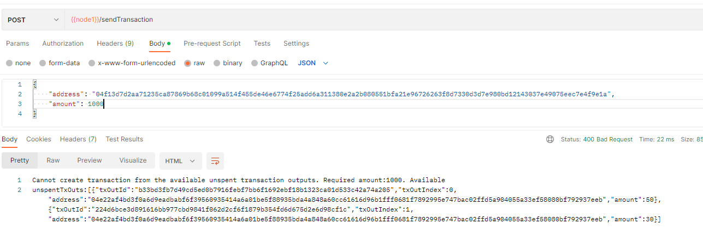
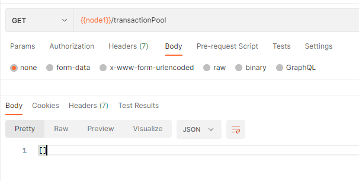
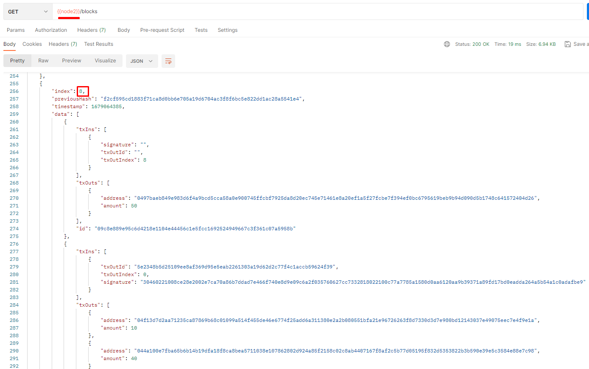

# 8-Blockchain. Lab2
Варіант 8

Михайло Корешков, ФІ-91

---

**Мета роботи:** Дослiдження особливостей блокчейн-платформи з вiдкритим кодом NaiveCoin.

---

## Вступ
Робота матиме декілька частин: практичну та теоретичну. В практичній частині я займатимуся запуском та дослідженням особливостей платформи NaiveCoin з використанням віртуальних машин (контейнерів) Docker. У якості умовного плану роботи візьму матеріал https://lhartikk.github.io/ від автора платформи.   В теоретичній частині я проведу аналіз отриманої криптовалюти: опишу використаний протокол, умови консенсусу, формат блоків, транзакцій та адрес; а також проведу базові обрахунки щодо стійкості до деяких атак.

## Практична частина

### 1. Огляд платформи
*NaiveCoin* - це платформа для створення простого розподіленого (на декілька комп'ютерів-нод) блокчейну із підтримкою функціоналу криптовалюти. Криптовалютний функціонал полягає у тому, що платформа підтримує протокол proof of work та має все необхідне для створення нових коінів та роботи з транзакціями. 

Платформа реалізована як typescript скрипт. Щоб створити ноду розподіленого блокчейну необхідно запустити цей скрипт на ноді. Після запуску нода матиме два сервіси: порт для пірингового зв'язку З іншими нодами за протоколом WebSocket та HTTP сервер для керування.
- Під піринговим зв'язком або p2p тут мається на увазі  що зацікавлені ноди спілкуватимуться між собою напряму, без центрального серверу. З цього випливатиме необхідність для кожної ноди зазначити список інших нод вручну.
- Сервер для керування дає адміністратору ноди доступ до її статусу, деталей її копії блокчейну, до додавання транзакцій та ручного запуску генерації (майнінгу) нового блоку

### 2. Встановлення та запуск
Я створив форк GitHub репозиторію https://github.com/lhartikk/naivecoin з вихідним кодом платформи (доступний за посиланням https://github.com/mkrooted256/naivecoin-term8) та завантажив його собі на комп'ютер.

Далі створив файл `Dockerfile` із специфікаціями контейнера, що мітитиме ноду, та файл `docker-compose.yml` із правилом запуску всієї мережі з декількох нод в контейнерах.
Також знадобилося змінити конфігурацію typescript.

Мережа складатиметься з 3 нод, з'єднаних послідовно (3-2, 2-1). **TODO: спробувати інші топології?**

Запускаємо 

  
...  
  
...  
  

- Перший запит. Об'єднання нод в мережу
       
    

- Другий запит. Стан блокчейну
    

- За спроби провести транзакцію нода вивела помилку, бо перша транзакція має бути створенням нових коінів:  
      
    

- Збережемо адреси гаманців нод:  
    ...
    ```
    node1: 04e22af4bd3f0a6d9eadbabf6f39560935414a6a01be5f88935bda4a848a60cc61616d96b1fff0681f7892995e747bac02ffd5a904055a33ef58080bf792937eeb
    node2: 04f13d7d2aa71235ca87869b68c01099a514f455de46e6774f25add6a311380e2a2b080551bfa21e96726263f8d7330d3d7e980bd12143037e49075eec7e4f9e1a
    node3: 0497baeb849e983d6f4a9bcd5cca58a0e900745ffcbf7925da8d20ec745e71461e8a20ef1a5f27fcbe7f394ef0bc6795619beb9b94d090d5b1748c641572404d26
    ```

    Також бачимо, що всі гаманці порожні  
    

    А список my unspent transaction output порожній  
    

### 3. Проведення транзакцій
- Проводимо coinbase транзакцію на першій ноді
      
    Бачимо, що баланс першого гаманця збільшився  
      
    А також з'явилася unspent transaction
      
    Також перевіримо стан блокчейну на інших нодах:
      
    Бачимо, що зміни поширились з першої на всі ноди.

- Транзакція з першої на другу ноди.  
      

    Звернемо увагу на деікілька речей (тут і далі "коін" це синонім для unspent transaction output або просто для транзакції).
    1. Бачимо класичну модель транзакції: декілька вхідних коінів та декілька вихідних. Вихідних коінів завжди не більше двох. Вхідні коіни "знищуються", один вихідний коін йде адресату, а інший - це "решта", що повертається відправнику.
    2. Список блоків та баланси гаманців не змінилися, бо транзакція ще не потрапила в жоден блок
    3. Транзакція потрапила в загальний для всіх нод пул транзакцій  
        

- Майнимо блок на першій ноді.  
    Бачимо, що блок поширився на всі ноди.  
      
    А також бачимо, що зміни в балансах застосувалися.  
     

- Надішлемо 60 коінів третій ноді, щоб продемонструвати об'єднання коінів  
      
    Проаналізуємо вхідні коіни (TxIns)
    1. 50 взято з першого (та єдиного) виходу coinbase транзакції, змайненої на першій ноді 
    2. 10 взято з другого виходу попередної транзакції 

### 4. Реакція на зловмисну ноду
- Надішлемо 1000 коінів з першої на другу ноду, щоб продемонструвати відхилення невалідної транзакції  
    Спочатку я додам транзакцію у пул з першої ноди, а потім змайню іншою (третьою) нодою.  
    Оскільки ноди реалізовані чесно, то операція провалилась ще на етапі створення транзакції.  
      
    Тому я відредагував код та додав опцію "malicious", яка обійде всі перевірки для операції. Спробуємо ще раз  

    > Хочу наголосити, що тут мені знадобилося перезавантажити першу ноду. Після запуску та з'єднання з іншими нодами вона автоматично відновила блокчейн та свій актуальний баланс за інформацією від них.

    > Нова адреса першої ноди `0493f47b2523cc03bfdfa0f717c654295d030a3ba4cea379445bb5415497f9da69a8de95e208922fdc2d90e7100a5a767d22002ac2a6d3e51c01a3dbd4c3478cd5`

    
    
    

    Транзакція залишилась в transaction pool лише зловмисної ноди, всі інші відкинули її.

- Спробуємо змайнити блок на зловмисній ноді та подивимося на реакцію інших нод.  

    Спостерігаємо відкидання опублікованого блоку
    

    А також розбіжності в стані блокчейну для різних нод:
     та 

### 5. Атака подвійної витрати
План виконання атаки наступний:
1. транзакція з першої на другу ноду 
2. роз'єднати мережеве з'єднання між нодами
3. змайнити блок з цією транзакцією на третій ноді
4. очистити пул транзакцій на першій ноді
5. змайнити два блоки на першій ноді
6. відновити з'єднання між нодами

В результаті друга та третя ноди мають замінити свій блокчейн тим, що пропонує перша нода.

> Для виконання цієї атаки необхідно реалізувати функцію ручного очищення пулу транзакцій

> нова адреса першої ноди `044a100e7fba65b6b14b19dfa18f8ca8bea5711038e107862802d924a85f2158c02c8ab4407167f8af2c5b77d05195f832d5353822b3b590e39e5c3584e88e7c98`

Роз'єднання зв'язку виконуватиму командою `docker network disconnect naivecoin_coin naivecoin-node1-1`.

1. транзакція з першої на другу ноду 
2. роз'єднати мережеве з'єднання між нодами  
    ```
    docker network disconnect naivecoin_coin naivecoin-node1-1
    docker network connect bridge naivecoin-node1-1
    ```.  
    
3. змайнити блок з цією транзакцією на третій ноді 
4. очистити пул транзакцій на першій ноді  
5. змайнити два блоки на першій ноді   
6. відновити з'єднання між нодами  
    `docker network connect naivecoin_coin naivecoin-node1-1`  
    Але спочатку подивимося стан блокчейну з точки зору різних нод:
    1. нода 1  
        
    2. нода 2  
        
    3. нода 3  
        
7. результат  
      
    1. нода 1  
        
    2. нода 2  
        
    3. нода 3  
        
    
Отже, атака успішло виконана.

## Теоретична частина

Криптовалюта - це в першу чергу однорангова мережа обліку транзакцій. На відміну від класичних електронних платіжних засобів, в криптовалюті зазвичай немає центрального органу обліку. Натомість будь-хто може доєднатися до колективного обліку у вигляді "ноди", встановивши на свій комп'ютер відповідне ПЗ. Довіра до криптовалюти забезпечується тим, що ноди отримують винагороду за чесне ведення обліку. При цьому чесність перевіряється іншими нодами, яким не вигідно підтримувати зловмисні дії, бо в результаті це може призвести до втрати довіри до коіну, а згодом до її знецінення. Знецінення валюти не вигідно власникам нод, бо в протоколі PoW видобуток нових коінів вимагає великі інвестиції у обчислювальний час.

Елементарна складова криптовалюти - це транзакція. Транзакція - це неподільний запис про знищення та створення коінів. При цьому коіни є в деякому сенсі неспостережуваними: самі по собі вони не обліковуються, не мають свого унікального ідентифікатора, а їх власник визначається переглядом історії транзакцій.

Основний суб'єкт криптовалюти - це гаманець. Гаманець - це пара приватного та публічного ключів асиметричного шифрування. Публічний ключ гаманця також називається його адресою. Переказ грошей між гаманцями реалізовано як знищення "вхідних" коінів, що належать відправнику, та створення нового "вихідного", що належатиме отримувачу. Оскільки коін є подільним, вихідних коінів може бути декілька. Типова ситуація, коли на вході транзакції багато коінів, що в сумі дають достатню суму для створення нового першого коіна бажаної вартості для адресата; решта повертається відправнику шляхом створення другого коіна. 

Транзакція має бути підписана цифровим електронним підписом з використанням приватного ключа гаманця відправника. Тоді перевірка буде виконуватись його публічним ключем (що також є його адресою).

Для ускладнення підробки історії транзакцій, в криптовалютах використовується блокчейн - база даних, організована у вигляді лінійної послідовності блоків. Кожен блок містить в собі хеш попереднього. Таким чином зміна одного блоку призведе до зміни його хешу та хешів всіх наступних блоків. При цьому, створення нового блоку - це штучно обчислювально складна оперція, отож за більшості чесних нод, зловмисник не зможе створити достатню кількість блоків.
За неоднозначності, консенсус між нодами досягається шляхом вибору валідного чейну із найбільшою сумарною 'складністю'.

Найбільша складова блоку - це список транзакцій. Перша транзакція блоку має бути 'coinbase' - створенням нових коінів. Власником нових коінів зазвичай є автор блоку - в цьому вигода встановлення ноди. Окрім транзакцій, блок містить свій індекс, час створення, свій параметр складності, та спеціальне поле 'nonce'. Блоки створюються тоді, коли набирається достатньо транзакцій в спільному для всіх пулі непідтверджених транзакцій.

Складність створення (майнінгу) нового блоку полягає у тому, щоб підібрати таке значення поля 'nonce' для списку транзакцій та метаданних блока щоб хеш комбінації їх всіх починався на певну кількість нулів. Ця кількість нулів і буде параметром складності блока. Оскільки хеш-функція відображає простір можливих nonce в простір хешів в деякому сенсі рівномірно, то час пошуку валідного nonce буде зростати експоненційно з ростом параметра складності.

Параметр складності вибирається на основі поточного середнього часу створення нових блоків та заданого в першому блоці бажаного часу. Складність зростає якщо блоки створюються зашвидко і падає якщо занадто повільно. Наприклад:


Тут видно що:
- за нульової складності `nonce` залишається нульовим, бо підходить будь-який хеш і перебирати nonce не потрібно
- складність зростає кожні 10 блоків, бо 10 - це заданий в першому блоці інтервал оновлення складності 

---

Для ефективного проведення транзакцій використовується так звана таблиця utxo 'unspent transaction outputs' - невикористаних виходів транзакцій. "Невикористаний вихід транзакції" - це за своєю суттю формальна назва для коіна, що комусь належить. Окрім історії блоків та пулу транзакцій, ноди також ведуть облік таблиці utxo. Поточний баланс гаманців визначається саме з цієї таблиці. Зверну увагу, що входи транзакції це виходи деяких інших транзакцій. Коли транзакція опрацьовується, її входи прибирається із таблиці невикористаних виходів транзакцій, а виходи до цієї таблиці додаються.

## Висновки

У цій роботі я
- ознайомився із принципами роботи блокчейнів на протоколі PoW та стисло сформулював їх, 
- розвернув тестову криптовалюту на своєму ПК,
- спробував реалізувати деякі атаки на блокчейн на практиці.
